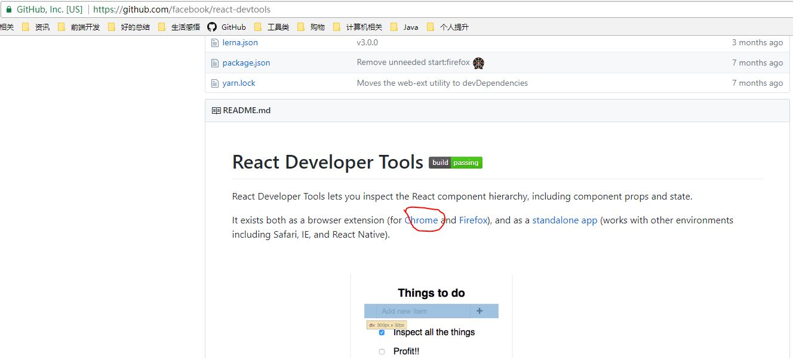
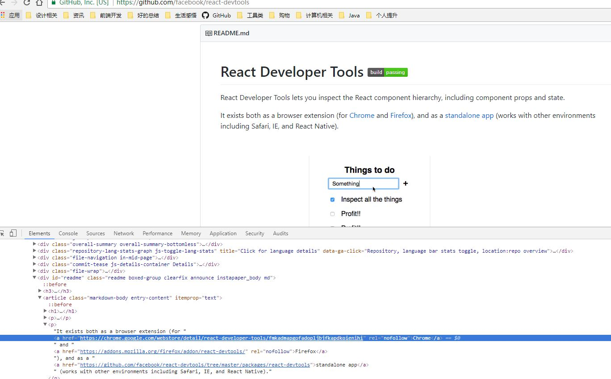
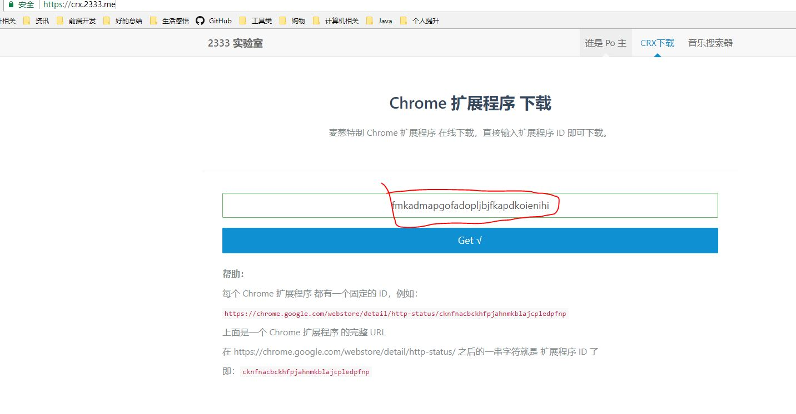
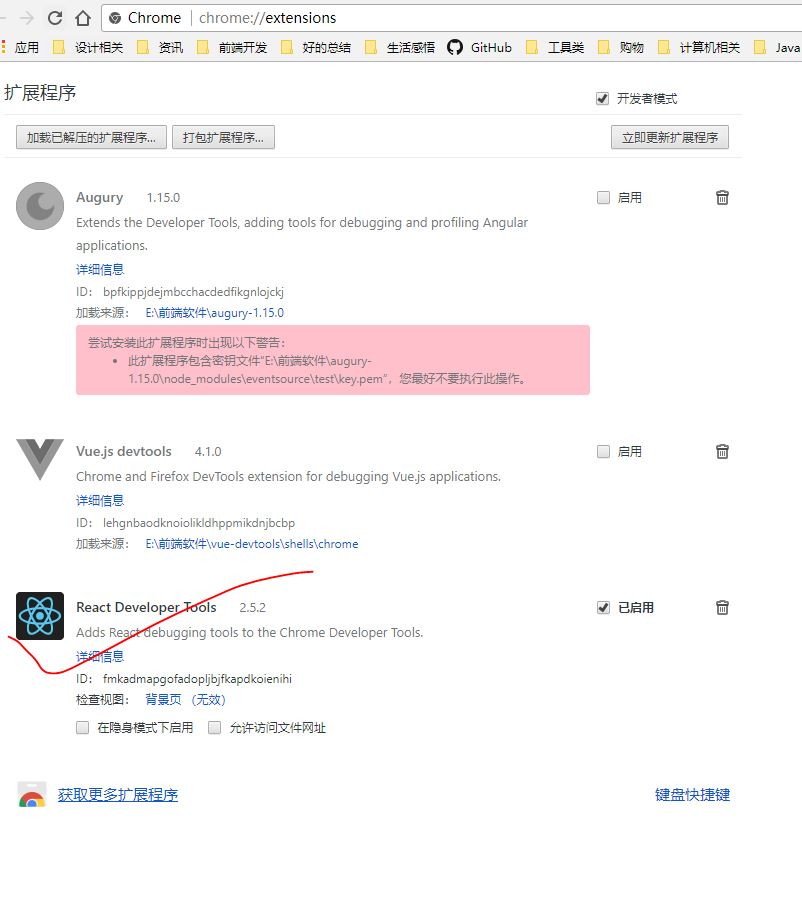

# React Developer Tools安装-通用，无需翻墙
在国内因为网络原因，通常无法正常从谷歌应用商店中安装谷歌浏览器插件，作为前端开发人员，主要与浏览器打交道，一些好的浏览器插件可以让我们的工作事半功倍，甚至复杂场景下必须依赖插件来定位和解决一些问题，多掌握一些插件安装技巧可以让我们更好的应对国内糟糕的网络环境。

首先先看一个链接
[Chrome扩展程序crx的下载和安装方法](https://jingyan.baidu.com/article/e4511cf35c2df92b845eafb3.html)

该文档中第一条，通过[Chrome 扩展程序 下载](https://crx.2333.me/)下载插件，如果知道插件的扩展程序 ID，基本上就没有太大问题了，获取插件的扩展程序 ID的方法一般必须得知道插件地址，解决该问题，可以从[React Developer Tools](https://github.com/facebook/react-devtools)得到答案。

在React Developer Tools的GitHub上，已经直接给出了链接，打开控制台》查看元素》选择这个链接，就可以在控制台的HTML代码中看到完整的地址

最终拿到的地址是这样的
<pre><code>https://chrome.google.com/webstore/detail/react-developer-tools/fmkadmapgofadopljbjfkapdkoienihi</code></pre>
这里面最后面的字符串就是我们需要的插件的扩展程序 ID

然后在[Chrome 扩展程序 下载](https://crx.2333.me/)输入刚才拿到的插件的扩展程序 ID，查找我们需要的插件

完成后直接下载，将下载后的插件拖到安装扩展程序界面，即可安装。
