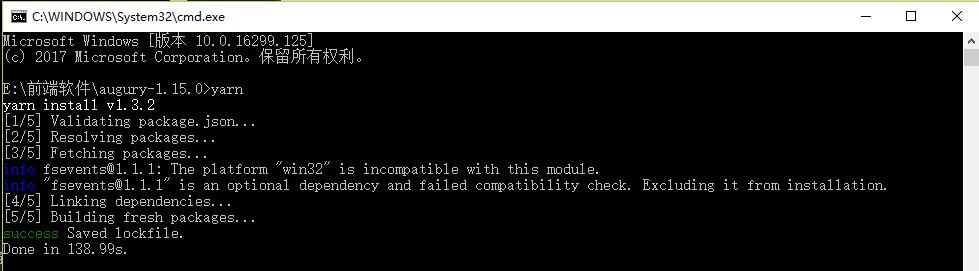
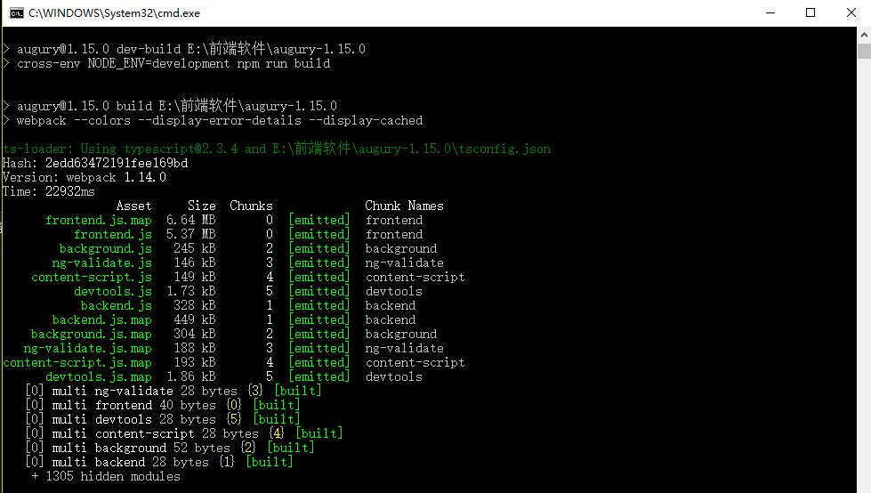
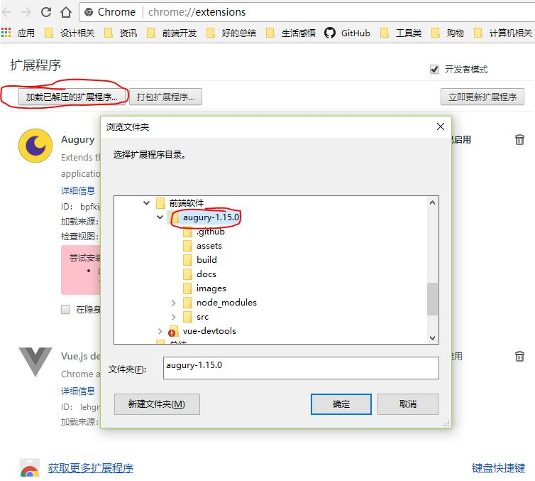
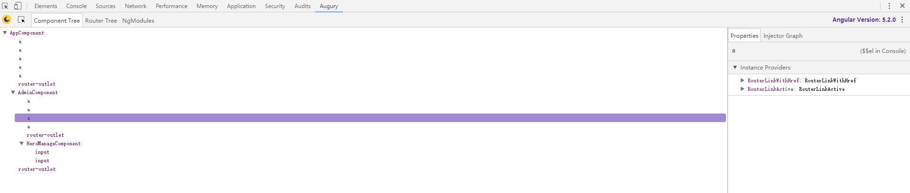
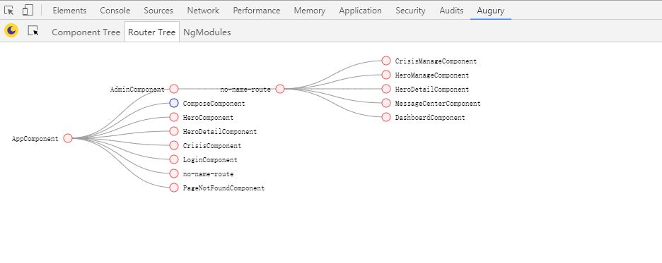

## augury
### augury的简介
Angular专用的chrome 调试插件，可方便的查看
+ component结构
+ 单个Component的具体属性和方法
+ 可视化显示component关系
+ router结构
+ 每个模块的概览

### 如何安装
#### Chrome 网上应用店
因为国内网络原因，该方法并不太方便 
可尝试网友推荐的一些替代方式[Chrome扩展程序crx的下载和安装方法](https://jingyan.baidu.com/article/e4511cf35c2df92b845eafb3.html) 
[augury官方站点（英文）](https://augury.angular.io/)

#### 使用源文件构建
[GitHub地址](https://github.com/rangle/augury)

下载源码有两种方式，一种是直接下载源码压缩包，另一种是是由git工具下载
<pre><code>git clone git://github.com/rangle/augury</code></pre>

下载源码后进入源码根目录，在该目录下打开命令行工具，执行以下命令
<pre><code>yarn
</code></pre>

<pre><code>npm run dev-build
</code></pre>

> 该方法依赖nodejs/npm/yarn以及一些必要的依赖，如果执行过程遇到异常，可根据提示自行安装相关依赖，我这边已经成功安装无任何异常

构建完成后，打开谷歌浏览器扩展工具，选择加载已解压的安装程序

点击`加载已解压的安装程序`>`选择插件源文件根目录`>`点击确认`

### 功能展示
 
 
 

### 相关博客
[Angular2-使用Augury来调试Angular2程序](https://www.jianshu.com/p/efecaea287f2)

> 祝大家能合理运用工具提高开发效率