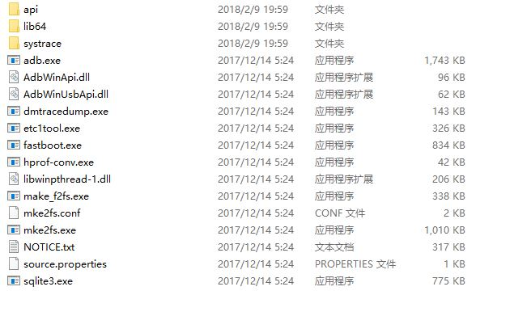
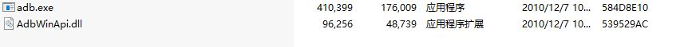
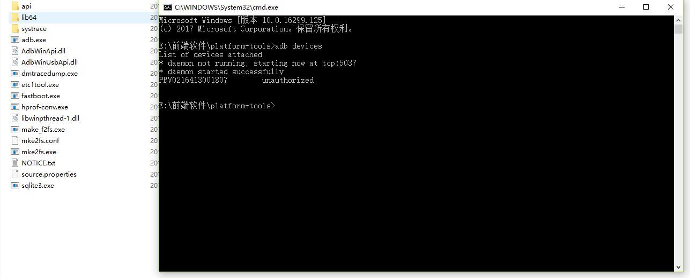
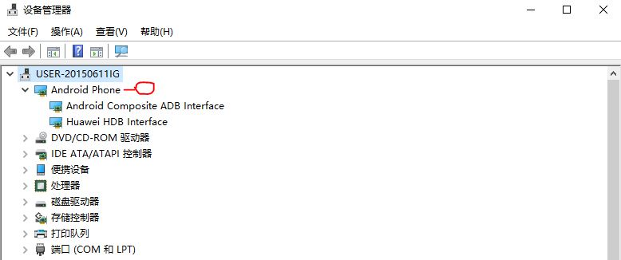
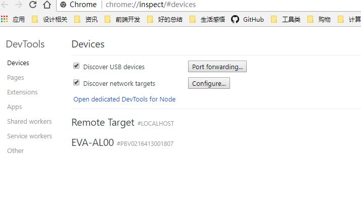
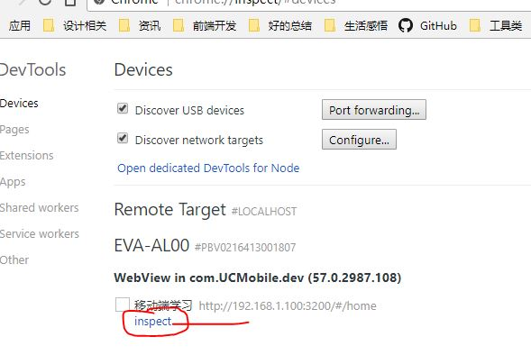

## chrome调试移动端UC浏览器

### ADB工具

在许多 Android 用户多次呼吁之后，Google 终于将ADB工具包(带Fastboot )作为单独的文件提供给用户下载。以前这些文件只包含在大尺寸的 Android SDK 或 Android Studio 当中提供给用户，现在这种变化意味着它们现在比以往更快，更容易执行和加载。

多年来，为了帮助克服只为2个小文件，下载大量文件的问题，第三方网站往往单独提供这2个文件，但出于安全考虑，许多人更喜欢使用官方工具。通过让 ADB 和 Fastboot 这2个软件更容易获得，Google 有效地提升了解锁手机和刷机用户数量。

### 下载ADB工具

以下是adb工具包最新2017Google官方版下载地址：

[ADB和Fastboot for Windows](https://dl.google.com/android/repository/platform-tools-latest-windows.zip)

[ADB和Fastboot for Mac](https://dl.google.com/android/repository/platform-tools-latest-darwin.zip)

[ADB和Fastboot for Linux](https://dl.google.com/android/repository/platform-tools-latest-linux.zip)

由于这些是直接的 Google 链接，用户可以确保下载不仅是官方的，而且将始终能够获得最新版本的 ADB 和 Fastboot 。

或者可以下载UC浏览器开发者中心提供的[ADB工具](http://www.uc.cn/business/developer/)

下载后解压出来如下：

官方完整版=>

UC提供的精简版，比较老旧=>

### 安装ADB工具
其实是免安装的，有建议拷贝到系统目录，也有建议将目录添加到环境变量中，或者在文件所在目录下执行，一下是使用最新的安装包在当前目录下执行命令行的结果：

如果没有报错，则说明安装成功，如果有报错，则可根据报错在网上寻找相应解决办法。

使用前面两种方式则在任何目录下执行命令行工具都可以。

### 安装UC浏览器开发者版

在[官网上](http://www.uc.cn/business/developer/)下载，或者其他渠道，问题不大

### 手机接入电脑，打开USB调试
不清楚的可以网上搜索，问题不大，下面讲下怎么看手机是否已经接入电脑

打开设备管理器（win7从`我的电脑`右键`设备管理器`；win10 `windows+X`或者直接搜索）

如果能看到Android Phone则说明已经成功连上电脑

在chrome中打开`chrome://inspect/#devices`，可以看到这样的界面

启动`adb`,中间可能涉及到需要手机上授权，运行`adb devices`看到设备列表里有需要调试的移动设备，则说明启动成功，如果报错，则需要自行网上寻找解决方案，在这一步很容易出问题，我也是折腾了好久才搞定，之前失败的场景现在不方便重现，总之遇到问题一定要多借助网络上的资源

在浏览器中打开检查设备,可以直接输网址`chrome://inspect`或者Chrome浏览器的菜单– 更多工具 – 检查设备

如果在`Remote Target #LOCALHOST`没有任何设备，则说明adb没有启动或者手机没有打开USB调试，当然也可以通过WiFi来连接手机和电脑，具体可以看adb工具的使用指南，下面附上一个相关的链接，类似的有很多，可以自己搜索关键字`adb使用教程`

[移动端Web开发调试之Chrome远程调试(Remote Debugging)](http://blog.csdn.net/freshlover/article/details/42528643)

如果上面一切都已经OK了，在可以看到这样的界面，里面列出了在Android设备上打开的网页，点击相应的`inspect`就可以调试？

正常情况点击`inspect`会弹出一个窗口，窗口加载一会后有可能是一个空白页面，这是因为第一次使用这个功能需要加载 https://chrome-devtools-frontend.appspot.com 上的资源，由于国内网络的原因，需要翻墙，目前网上提供的其他方案似乎并没有十分可靠的，或许有，我没有找到。

以上是一个不完整的过程，最终还是卡在了翻墙这一步，当然这中间也有一些其他的波折，最终借助网络搜索引擎，大部分得到了解决，如果大家是用过UC浏览器开发者中心提供的版本最终也成功了的，可以使用那个方案，我在使用过程中始终无法搜索到Android设备，可能是手机系统版本和开发者工具不兼容吧，毕竟隔离7年。