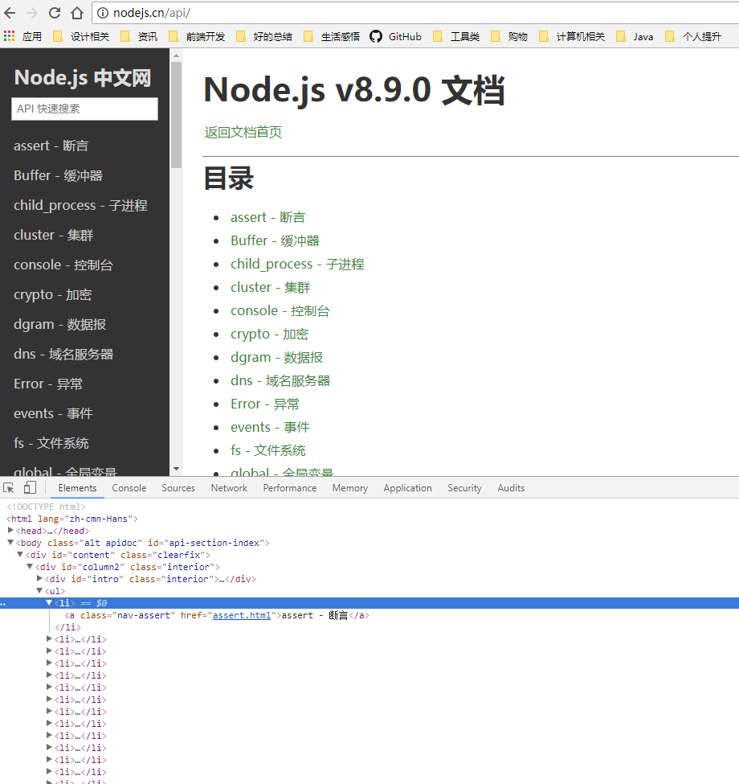
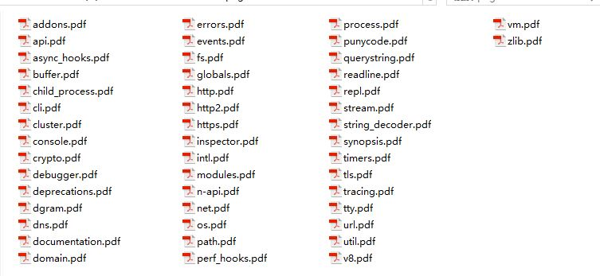

# 如何获取要爬取页面的地址？
首先进入[node api官网](http://nodejs.cn/api/)

通过谷歌浏览器开发工具查看所有api的链接的dom结构，发现首页左边导航条里面所有的内容是放在一个ul元素里面的，一个api页面的链接占用了一个li，li里面有一个a标签，a标签的href是相对于当前目录的地址。

在控制台运行一下代码，最终可以在控制台获取到所有的api页面的相对路径
<pre><code>var pageUrls = [];
var lindElements = document.querySelectorAll("div#apicontent ul li a");
var len = lindElements.length;
var i;
for (i = 0; i < len; i++) {
    pageUrls.push(lindElements[i].getAttribute("href"));
}
console.log(JSON.stringify(pageUrls));
</code></pre>

运行之后得到的结果如下：
<pre><code>["assert.html","buffer.html","child_process.html","cluster.html","console.html","crypto.html","dgram.html","dns.html","errors.html","events.html","fs.html","globals.html","http.html","https.html","modules.html","net.html","os.html","path.html","process.html","querystring.html","readline.html","repl.html","stream.html","string_decoder.html","timers.html","tls.html","tty.html","url.html","util.html","v8.html","vm.html","zlib.html","/api/documentation.html#documentation_stability_index","async_hooks.html","http2.html","inspector.html","n-api.html","perf_hooks.html","deprecations.html","domain.html","punycode.html","documentation.html","synopsis.html","addons.html","cli.html","debugger.html","intl.html","tracing.html","esm.html"]
</code></pre>

# 知道了要爬取页面的地址，如何将页面一个一个爬下来
新建betchCapturePage.js，内容如下：
<pre><code>var allPages = ["assert.html",
    "buffer.html",
    "child_process.html",
    "cluster.html",
    "console.html",
    "crypto.html",
    "dgram.html",
    "dns.html",
    "errors.html",
    "events.html",
    "fs.html",
    "globals.html",
    "http.html",
    "https.html",
    "modules.html",
    "net.html",
    "os.html",
    "path.html",
    "process.html",
    "querystring.html",
    "readline.html",
    "repl.html",
    "stream.html",
    "string_decoder.html",
    "timers.html",
    "tls.html",
    "tty.html",
    "url.html",
    "util.html",
    "v8.html",
    "vm.html",
    "zlib.html",
    "/api/documentation.html#documentation_stability_index",
    "async_hooks.html",
    "http2.html",
    "inspector.html",
    "n-api.html",
    "perf_hooks.html",
    "deprecations.html",
    "domain.html",
    "punycode.html",
    "documentation.html",
    "synopsis.html",
    "addons.html",
    "cli.html",
    "debugger.html",
    "intl.html",
    "tracing.html",
    "esm.html"
];
var webPage = require('webpage');
var index = 0;
var baseUrl = "http://nodejs.cn/api/";

function loadNextPage() {
    newCapture(baseUrl + allPages[index]);
}

//捕获页面生成PDF文件
function newCapture(pageUrl) {
    var page = webPage.create();
    page.paperSize = {
        format: 'A4',
        orientation: 'portrait',
        border: '1cm'
    };
    page.open(pageUrl, function(status) {
        if (status === "success") {
            var pageName = parsePageName(pageUrl);
            //延迟1s确保页面所有的脚本已经执行完
            setTimeout(function() {
                page.render("./page/" + pageName + ".pdf");
                console.log('render ' + pageName + '.pdf');
                if (index < allPages.length) {
                    loadNextPage();
                }
                //如果最后一个页面已经捕获完成，则退出
                if (index === allPages.length) {
                    phantom.exit(0);
                    console.log('exit');
                }
            }, 1000);
        } else {
            console.log(pageUrl);
        }
    });
    index++;
}

//去掉页面名称的锚点
function removeSuffix(pageName) {
    var endPos = pageName.indexOf('.');
    if (endPos === -1) {
        return pageName;
    }
    return pageName.substring(0, endPos);
}

function parsePageName(pageUrl) {
    if (pageUrl) {
        //提取出“/”与“.html”直接的字符串
        var pathArr = pageUrl.split('/');
        //去掉多余的锚点
        if (pathArr[pathArr.length - 1] === '') {
            return removeSuffix(pathArr[pathArr.length - 2]);
        } else {
            return removeSuffix(pathArr[pathArr.length - 1]);
        }
    }
}
// 开始捕获页面
newCapture(baseUrl);
</code></pre>

在该js文件所在目录下执行命令行工具，执行如下命令
<pre><code>phantomjs betchCapturePage.js
</code></pre>
运行结果如下：

