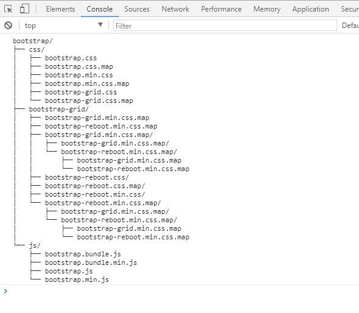

## 将文件目录解析成树形结构
### 文件目录的JSON数据格式如下：

<pre><code>文件夹数据及结构
[{
	"name":'',
	"type":"folder",
	"folder":[{
		"name":'',
		"type":"file"
	}]
},{
	"name":'',
	"type":"file"
}]
</code></pre>

### 预期解析后的样式如下（数据非真实数据）：
<pre><code>bootstrap/
├── css/
│   ├── bootstrap.css
│   ├── bootstrap.css.map
│   ├── bootstrap.min.css
│   ├── bootstrap.min.css.map
│   ├── bootstrap-grid.css
│   └── bootstrap-grid.css.map
├── bootstrap-grid/
│   ├── bootstrap-grid.min.css.map
│   ├── bootstrap-reboot.min.css.map
│   ├── bootstrap-grid.min.css.map/
│   │   ├── bootstrap-grid.min.css.map/
│   │   └── bootstrap-reboot.min.css.map/
│   │       ├── bootstrap-grid.min.css.map
│   │       └── bootstrap-reboot.min.css.map
│   ├── bootstrap-reboot.css/
│   ├── bootstrap-reboot.css.map/
│   ├── bootstrap-reboot.min.css/
│   └── bootstrap-reboot.min.css.map/
│       ├── bootstrap-grid.min.css.map/
│       └── bootstrap-reboot.min.css.map/
│           ├── bootstrap-grid.min.css.map
│           └── bootstrap-reboot.min.css.map
└── js/
    ├── bootstrap.bundle.js
    ├── bootstrap.bundle.min.js
    ├── bootstrap.js
    └── bootstrap.min.js
</code></pre>

### 解析部分代码如下：
<pre><code>var TAB = '    ';
var FILE_PREFIX = '├── ';
var FOLDER_PREIX = '│   ';
var LAST_FILE_PREFIX = '└── ';
var FOLDER_SRRFFIX = '/';

function parseAndInjectPrefix(returnValue, directory, prefix) {
    var i, ii = directory.length;
    for (i = 0; i < ii; i++) {
        var iPrefix = [];
        //先把最前面的补上
        if (directory[i].prefix === undefined) {
            directory[i].prefix = [];
        }
        if (prefix != undefined && Array.isArray(prefix)) {
            directory[i].prefix = directory[i].prefix.concat(prefix);
            iPrefix = iPrefix.concat(prefix);
        }

        //处理中间的
        if (i + 1 === ii) { //如果是最后列
            directory[i].prefix.push(LAST_FILE_PREFIX);
            iPrefix.push(TAB);
        } else {
            directory[i].prefix.push(FILE_PREFIX);
            iPrefix.push(FOLDER_PREIX);
        }
        //处理末尾
        directory[i].prefix.push(directory[i].name);
        if (directory[i].type === 'folder') {
            directory[i].prefix.push(FOLDER_SRRFFIX);
        }
        returnValue.push(directory[i].prefix);
        //处理子级，如果存在
        if (directory[i].type === 'folder' && directory[i].folder && Array.isArray(directory[i].folder)) {
            parseAndInjectPrefix(returnValue, directory[i].folder, iPrefix);
        }
    }
    return returnValue;
}

function parseFolderList(folderTreeList) {
    var i, ii = folderTreeList.length;
    var codeStr = '';
    for (i = 0; i < ii; i++) {
        folderTreeList[i].shift();
        codeStr += folderTreeList[i].join('');
        codeStr += '\r\n';
    }
    console.log(codeStr);
}
parseFolderList(parseAndInjectPrefix([], folderData));</code></pre>

### 测试结果
使用的数据为：
<pre><code>[{
    "name": 'bootstrap',
    "type": "folder",
    "folder": [{
        "name": 'css',
        "type": "folder",
        "folder": [{
            "name": 'bootstrap.css',
            "type": "file"
        }, {
            "name": 'bootstrap.css.map',
            "type": "file"
        }, {
            "name": 'bootstrap.min.css',
            "type": "file"
        }, {
            "name": 'bootstrap.min.css.map',
            "type": "file"
        }, {
            "name": 'bootstrap-grid.css',
            "type": "file"
        }, {
            "name": 'bootstrap-grid.css.map',
            "type": "file"
        }]
    }, {
        "name": 'bootstrap-grid',
        "type": "folder",
        "folder": [{
            "name": 'bootstrap-grid.min.css.map',
            "type": "file"
        }, {
            "name": 'bootstrap-reboot.min.css.map',
            "type": "file"
        }, {
            "name": 'bootstrap-grid.min.css.map',
            "type": "folder",
            "folder": [{
                "name": 'bootstrap-grid.min.css.map',
                "type": "folder",
                "folder": []
            }, {
                "name": 'bootstrap-reboot.min.css.map',
                "type": "folder",
                "folder": [{
                    "name": 'bootstrap-grid.min.css.map',
                    "type": "file",
                    "folder": []
                }, {
                    "name": 'bootstrap-reboot.min.css.map',
                    "type": "file",
                    "folder": []
                }]
            }]
        }, {
            "name": 'bootstrap-reboot.css',
            "type": "folder",
            "folder": []
        }, {
            "name": 'bootstrap-reboot.css.map',
            "type": "folder",
            "folder": []
        }, {
            "name": 'bootstrap-reboot.min.css',
            "type": "folder",
            "folder": []
        }, {
            "name": 'bootstrap-reboot.min.css.map',
            "type": "folder",
            "folder": [{
                "name": 'bootstrap-grid.min.css.map',
                "type": "folder",
                "folder": []
            }, {
                "name": 'bootstrap-reboot.min.css.map',
                "type": "folder",
                "folder": [{
                    "name": 'bootstrap-grid.min.css.map',
                    "type": "file",
                    "folder": []
                }, {
                    "name": 'bootstrap-reboot.min.css.map',
                    "type": "file",
                    "folder": []
                }]
            }]
        }]
    }, {
        "name": 'js',
        "type": "folder",
        "folder": [{
            "name": 'bootstrap.bundle.js',
            "type": "file"
        }, {
            "name": 'bootstrap.bundle.min.js',
            "type": "file"
        }, {
            "name": 'bootstrap.js',
            "type": "file"
        }, {
            "name": 'bootstrap.min.js',
            "type": "file"
        }]
    }]
}]</code></pre>

在浏览器中运行后在控制台看到的结果为：

