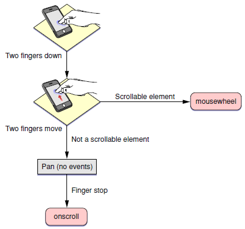
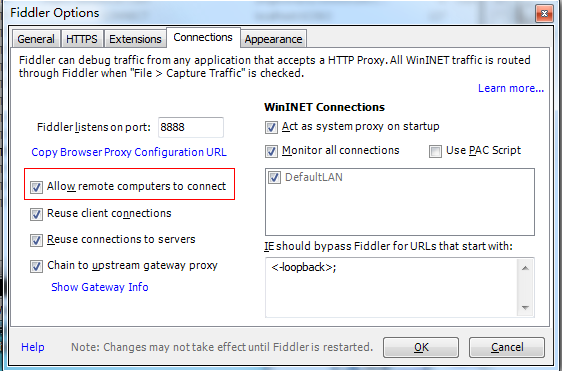

# 移动端开发问题汇总
## 1.	Meta标签
+ 添加到主屏后的标题（IOS） 
&lt;meta name="apple-mobile-web-app-title" content="标题"	&gt;

+ 启用 WebApp 全屏模式（IOS） 
当网站添加到主屏幕后再点击进行启动时，可隐藏地址栏（从浏览器跳转或输入链接进入并没有此效果） 
&lt;meta name="apple-mobile-web-app-capable" content="yes" /&gt;  
&lt;meta name="apple-touch-fullscreen" content="yes" /&gt;

+ 百度禁止转码
通过百度手机打开网页时，百度可能会对你的网页进行转码，往你页面贴上它的广告，非常之恶心。不过我们可以通过这个meta标签来禁止它：  
&lt;meta http-equiv="Cache-Control" content="no-siteapp" /&gt;
百度SiteApp转码声明

设置状态栏的背景颜色（IOS） 
设置状态栏的背景颜色，只有在 "apple-mobile-web-app-capable" content="yes" 时生效 
&lt;meta name="apple-mobile-web-app-status-bar-style" content="black-translucent" /&gt;
content 参数：
1.default ：状态栏背景是白色。
black ：状态栏背景是黑色。
black-translucent ：状态栏背景是半透明。 如果设置为 default 或 black ,网页内容从状态栏底部开始。 如果设置为 black-translucent ,网页内容充满整个屏幕，顶部会被状态栏遮挡。

+ 移动端手机号码识别（IOS） 
在 iOS Safari （其他浏览器和Android均不会）上会对那些看起来像是电话号码的数字处理为电话链接，比如： 
7位数字，形如：1234567 
带括号及加号的数字，形如：(+86)123456789 
双连接线的数字，形如：00-00-00111 
11位数字，形如：13800138000 
可能还有其他类型的数字也会被识别。我们可以通过如下的meta来关闭电话号码的自动识别： 
&lt;meta name="format-detection" content="telephone=no" /&gt;

+ 开启电话功能 
&lt;a href="tel:123456"&gt;123456&lt;/a&gt;

+ 开启短信功能 
&lt;a href="sms:123456"&gt;123456&lt;/a&gt; 

+ 移动端邮箱识别（Android） 
与电话号码的识别一样，在安卓上会对符合邮箱格式的字符串进行识别，我们可以通过如下的meta来管别邮箱的自动识别： 
&lt;meta content="email=no" name="format-detection" /&gt;  
同样地，我们也可以通过标签属性来开启长按邮箱地址弹出邮件发送的功能： 
<a mailto:dooyoe@gmail.com">dooyoe@gmail.com</a> 

+ 添加智能 App 广告条 Smart App Banner（IOS 6+ Safari） 
&lt;meta name="apple-itunes-app" content="app-id=myAppStoreID, affiliate-data=myAffiliateData, app-argument=myURL"&gt; 
有了智能应用程序横幅，当网站上有一个相关联的本机应用程序时，Safari浏览器可以显示一个横幅。 如果用户没有安装这个应用程序将显示“安装”按钮，或已经安装的显示“查看”按钮可打开它。 
在 iTunes Link Maker 搜索我们的应用程序和应用程序ID。 
&lt;meta name="apple-itunes-app" content="app-id=9999999"&gt; 
可以使用 app-argument 提供字符串值，如果参加iTunes联盟计划，可以添加元标记数据 
&lt;meta name="apple-itunes-app" content="app-id=9999999, app-argument=xxxxxx"&gt; 
&lt;meta name="apple-itunes-app" content="app-id=9999999, app-argument=xxxxxx, affiliate-data=partnerId=99&siteID=XXXX"&gt; 
横幅需要156像素（设备是312 hi-dpi）在顶部，直到用户在下方点击内容或关闭按钮，你的网站才会展现全部的高度。它就像HTML的DOM对象，但它不是一个真正的DOM。 

+ IOS Web app启动动画 
由于iPad 的启动画面是不包括状态栏区域的。所以启动图片需要减去状态栏区域所对应的方向上的20px大小，相应地在retina设备上要减去40px的大小
<pre><code>&lt;!-- iPhone --&gt;
&lt;link href="apple-touch-startup-image-320x460.png" media="(device-width: 320px)" rel="apple-touch-startup-image"&gt;
&lt;!-- iPhone (Retina) --&gt;
&lt;link href="apple-touch-startup-image-640x960.png" media="(device-width: 320px) and (-webkit-device-pixel-ratio: 2)" rel="apple-touch-startup-image"&gt;
&lt;!-- iPad (portrait) --&gt;
&lt;link href="apple-touch-startup-image-768x1004.png" media="(device-width: 768px) and (orientation: portrait)" rel="apple-touch-startup-image"&gt;
&lt;!-- iPad (landscape) --&gt;
&lt;link href="apple-touch-startup-image-748x1024.png" media="(device-width: 768px) and (orientation: landscape)" rel="apple-touch-startup-image"&gt;
&lt;!-- iPad (Retina, portrait) --&gt;
&lt;link href="apple-touch-startup-image-1536x2008.png" media="(device-width: 1536px) and (orientation: portrait) and (-webkit-device-pixel-ratio: 2)" rel="apple-touch-startup-image"&gt;
&lt;!-- iPad (Retina, landscape) --&gt;
&lt;link href="apple-touch-startup-image-2048x1496.png" media="(device-width: 1536px)  and (orientation: landscape) and (-webkit-device-pixel-ratio: 2)" rel="apple-touch-startup-image"&gt;
(landscape：横屏 | portrait：竖屏)</code></pre>

+ 添加到主屏后的APP图标 
指定web app添加到主屏后的图标路径，有两种略微不同的方式：
<pre><code>&lt;!-- 设计原图 --&gt;
&lt;link href="short_cut_114x114.png" rel="apple-touch-icon-precomposed"&gt;
&lt;!-- 添加高光效果 --&gt;
&lt;link href="short_cut_114x114.png" rel="apple-touch-icon"&gt;</code></pre>
* apple-touch-icon：在IOS6及以下的版本会自动为图标添加一层高光效果（IOS7开始已使用扁平化的设计风格） * apple-touch-icon-precomposed：使用“设计原图图标”
效果：
图标尺寸：
可通过指定size属性来为不同的设备提供不同的图标（但通常来说，我们只需提供一个114 x 114 pixels大小的图标即可 ）
官方说明如下
Create different sizes of your app icon for different devices. If you’re creating a universal app, you need to supply app icons in all four sizes.
For iPhone and iPod touch both of these sizes are required:
57 x 57 pixels
114 x 114 pixels (high resolution)
For iPad, both of these sizes are required:
72 x 72 pixels
144 x 144 (high resolution)

+ 优先使用最新版本 IE 和 Chrome
&lt;meta http-equiv="X-UA-Compatible" content="IE=edge,chrome=1" /&gt; 
+移动web最佳viewport设置 
布局viewport = 设备宽度 = 度量viewport 
<pre><code>&lt;meta name=” viewport” content = “width=device-width, initial-scale = 1, user-scalable = no”&gt;</code></pre>
宽度为设备宽度，初始缩放比例为1倍，禁止用户缩放

+ viewport模板
<pre><code>&lt;!DOCTYPE html&gt;
&lt;html&gt;
&lt;head&gt;
    &lt;meta charset="utf-8"&gt;
    &lt;meta content="width=device-width,initial-scale=1.0,maximum-scale=1.0,user-scalable=no" name="viewport"&gt;
    &lt;meta content="yes" name="apple-mobile-web-app-capable"&gt;
    &lt;meta content="black" name="apple-mobile-web-app-status-bar-style"&gt;
    &lt;meta content="telephone=no" name="format-detection"&gt;
    &lt;meta content="email=no" name="format-detection"&gt;
    &lt;title&gt;标题&lt;/title&gt;
    &lt;link rel="stylesheet" href="index.css"&gt;
&lt;/head&gt;
&lt;body&gt;
    这里开始内容
&lt;/body&gt;
&lt;/html&gt;</code></pre>

## 2.	单位
#### piexl 像素知识
640 * 1136的图片能不能在iphone5上完全展示？ 
iphone5分辨率640*1136 
逻辑像素与物理像素的关系 
px逻辑像素：浏览器使用的抽象单位 
dp，pt物理像素：设备无关像素 
dpr：设备像素缩放比 
计算公式：1px = (dpr)^2 * dp 
iphone5的 dpr = 2； 
DPI:打印机每英寸可以喷的墨汁点（印刷行业） 
PPI:屏幕每英寸的像素数量，即单位英寸内的像素密度 
目前，在计算机显示设备参数描述上，二者意思一致 
计算公式：以iphone5为例：ppi = √（1136^2 + 640^2）/4 = 326ppi（视网膜retina屏） 
注意：单位为硬件像素（物理像素），非px 
PPI越高，像素数越高，图像越清晰。但可视度月低（小），系统默认缩放比越大。 
retina屏（高清屏）：dpr都是>=2。 
#### 相对单位rem
为了适应各大屏幕的手机，px略显固定，不能根据尺寸的大小而改变，使用相对单位更能体验页面兼容性。 
em：是根据父节点的font-size为相对单位 
rem：是根据html的font-size为相对单位em在多层嵌套下，变得非常难以维护，rem更加能作为全局统一设置的度量那么，rem的基值设置为多少比较好？回归目的：为了适应各大手机屏幕rem = screen.width / 20 
不使用rem的情况：font-size 
一般来讲font-size是不应该使用rem的相对单位的。因为字体的大小是趋向于阅读的实用性，并不适合于排版布局。同理，趋向于一些固定的元素的特性。我们不使用rem而改为使用px去确保在不同屏幕上表现一致（跟rem的目的相反）。 
#### 移动端字体单位font-size选择px还是rem
对于只需要适配手机设备，使用px即可 
对于需要适配各种移动设备，使用rem，例如只需要适配iPhone和iPad等分辨率差别比较挺大的设备 
#### rem配置参考：
<pre><code>html {
    font-size: 10px
}

@media screen and (min-width:480px) and (max-width:639px) {
    html {
        font-size: 15px
    }
}

@media screen and (min-width:640px) and (max-width:719px) {
    html {
        font-size: 20px
    }
}

@media screen and (min-width:720px) and (max-width:749px) {
    html {
        font-size: 22.5px
    }
}

@media screen and (min-width:750px) and (max-width:799px) {
    html {
        font-size: 23.5px
    }
}

@media screen and (min-width:800px) and (max-width:959px) {
    html {
        font-size: 25px
    }
}

@media screen and (min-width:960px) and (max-width:1079px) {
    html {
        font-size: 30px
    }
}

@media screen and (min-width:1080px) {
    html {
        font-size: 32px
    }
}</code></pre>

## 3.字体
三大手机系统的字体：
+ ios 系统 
默认中文字体是Heiti SC 
默认英文字体是Helvetica 
默认数字字体是HelveticaNeue 
无微软雅黑字体

+ android 系统 
默认中文字体是Droidsansfallback 
默认英文和数字字体是Droid Sans 
无微软雅黑字体 

+ winphone 系统 
默认中文字体是Dengxian(方正等线体) 
默认英文和数字字体是Segoe 
无微软雅黑字体 

各个手机系统有自己的默认字体，且都不支持微软雅黑 如无特殊需求，手机端无需定义中文字体，使用系统默认
英文字体和数字字体可使用 Helvetica ，三种系统都支持 
移动端定义字体的代码  
<pre><code>body{font-family:Helvetica;}</code></pre>

## 4.尺寸
设计移动web
+ 方案一：根据设备的实际宽度来设计（常用）（不缩放） 
手机宽320px，我们就拿320px设计。

+ 方案二：1px = 1dp，易解决高清问题 
缩放0.5。根据设备的物理像素dp等于抽象像素px来设计。1px像素边框和高清图片都不需要额外处理。

以方案一为例，将pc端页面改成适应移动端的页面： 
在移动开发过程中要学会做减法，一些不太重要的东西可以隐藏起来。 
常见的 iPhone 和 Android 屏幕参数。 
设备 | 分辨率 | 设备像素比率
:-: | :-: | :-: 
Android LDPI | 320×240 | 0.75
Iphone 3 & Android MDPI | 320×480 | 1
Android HDPI | 480×800 | 1.5 
Iphone 4 | 960×640 | 2.0

## 5.布局
很多网站都是使用固定布局，以前凡客、淘宝也有段时间使用过流式布局，现在都改成固定布局。 
但是固定布局不适合移动开发。 
可以使用
+ (1)响应式布局：responsive 高清图片 retina px em rem
+ (2)flex弹性盒子布局：高效居中方案 等比例填充列行 background-size font-size 多行文本溢出

**flexbox弹性盒子布局** 
根据元素个数不同，自动填充 
display:-webkit-flex; 表示使用弹性布局 
子元素设置 flex:num; 占容器的比例 
+ 划分方式：
+ 等比划分（flex:num;表示）
+ 混合划分（有固定的像素（eg：100px）与flex:num;混合在一起）
+ 不定宽高的水平垂直居中：
<pre><code>{
    position：absolute;
    top：50%;
    left：50%;
    transform：translate（-50%，-50%）;
}

.parent {
    justify-content: center; //子元素水平居中
    align-items: center; //子元素垂直居中
    display: -webkit-flex;
}</code></pre>
新flex布局：
<pre><code>{
    display: -webkit-flex;
    -webkit-fiex: 1; //子元素的flex
    justify-content: center;
    align-items: center;
}</code></pre>
旧flexbox布局：
<pre><code>{
    display: -webkit-flex-box;
    -webkit-fiex-box: 1; //子元素的flex
    box-pack: center;
    box-center: center;
}</code></pre>
一种垂直居中的hack：
hack方式
<pre><code>{
    li {
        line-height: 568px;
        vertical-align: middle;
    }
    li img {
        vertical-align: middle;
    }
}</code></pre>
(2)更优雅的方式，对于高级浏览器来说
<pre><code>// 父元素
{
    position: absolute;
}

// 子元素
li {
    display: table-cell;
    /*盒模型变成表格的元素*/
    vertical-align: middle;
}</code></pre>
(3)另一种垂直居中方式
<pre><code>li {
    display: -webkit-box;
    -webkit-box-pack: center;
    -webkit-box-align: center;
}</code></pre>
#### 居中问题
+ table布局法
<pre><code>.box{ text-align:center; display:table-cell; vertical-align:middle; }</code></pre>
老版本flex布局法
<pre><code>.box {
    display: -webkit-box;
    -webkit-box-pack: center;
    -webkit-box-align: center;
    text-align: center;
}</code></pre>
#### 响应式布局
开发一个页面，在所有的设备上都能够完美展示。 
媒体查询：
<pre><code>@media screen and (max-width:100px) { }</code></pre>
媒体类型：screen（屏幕）
print（打印机）
handheld（手持设备）
all（通用）

**常用媒体查询参数：**
+ width —— 视口宽高
+ height —— 视口宽高
+ device-width —— 设备的宽高
+ device- height —— 设备的宽高
+ orientation：检查设备处于横向（landscape）还是竖屏（portrait）

phone系列媒体查询
<pre><code>@media only screen and (min-device-width: 320px) {
    //针对iPhone 3
}

@media only screen and (min-device-width: 320px)and (-webkit-min-device-pixel-ratio: 2) {
    //针对iPhone 4, 5c,5s, 所有iPhone6的放大模式，个别iPhone6的标准模式
}

@media only screen and (min-device-width: 375px)and (-webkit-min-device-pixel-ratio: 2) {
    //针对大多数iPhone6的标准模式
}

@media only screen and (min-device-width: 375px)and (-webkit-min-device-pixel-ratio: 3) {
    //针对所有iPhone6+的放大模式
}

@media only screen and (min-device-width:412px) and (-webkit-min-device-pixel-ratio: 3) {
    //针对所有iPhone6+的标准模式,414px写为412px是由于三星Nexus 6为412px，可一并处理
}</code></pre>

#### 响应式设计设计点
+ 设计点一：百分比布局 
仅仅使用媒体查询来适应不同固定宽度设计，只会从一组css到另一组css的切换。两种设计之间没有任何平滑渐变。只使用媒体查询，布局有时会变得不可控制。
当然，这只是建议，也有一些页面采用固定布局的情况下能够很好的在一些没有考虑过媒体查询情况下的设备上很好的展示。
+ 设计点二：弹性图片 
思路：无论何时，全都包在图片的元素宽度范围内，以最大的宽度同比完整的显示图片。 
<pre><code>img{ max-height: 100% }</code></pre>
+ 设计点三：重新布局，显示与隐藏 
当页面达到手机屏幕宽度的时候，很多时候就要放弃一些传统的页面设计思想。力求页面简单，做如下处理：
    + 同比例缩减元素尺寸
    + 调整页面结构布局
    + 隐藏冗余的元素
    + 经常需要切换位置元素使用【绝对定位】，减少重绘提高渲染性能。

**关于响应式设计的思考：** 
根据响应式设计的理念，一个页面包含所有设备不同屏幕的样式和图片，当一个移动设备访问一个响应式的页面，就会下载pc，笔记本，ipad等不同设备对应的样式。而这些样式却是冗余的，完全没有用。
权衡利弊：性能不是最优，但是能减少重复开发。
适配移动端比较好的布局方式是百分比+rem布局。
百分比的优势在于，同一个百分比的真实尺寸会跟随屏幕大小变化。

## 6.样式
媒体查询常用样式表：
<pre><code>&lt;link rel="stylesheet" media="all and (orientation:portrait)" href="portrait.css"&gt;    // 竖放加载
&lt;link rel="stylesheet" media="all and (orientation:landscape)"href="landscape.css"&gt;   // 横放加载</code></pre>
//竖屏时使用的样式
<pre><code>&lt;style media="all and (orientation:portrait)" type="text/css"&gt;
    #landscape { display: none; }
&lt;/style&gt;</code></pre>
//横屏时使用的样式
<pre><code>&lt;style media="all and (orientation:landscape)" type="text/css"&gt;
    #portrait { display: none; }
&lt;/style&gt;</code></pre>
+ ios系统中元素被触摸时产生的半透明灰色遮罩怎么去掉 
ios用户点击一个链接，会出现一个半透明灰色遮罩, 如果想要禁用，可设置-webkit-tap-highlight-color的alpha值为0，也就是属性值的最后一位设置为0就可以去除半透明灰色遮罩
<pre><code>a,button,input,textarea{
    -webkit-tap-highlight-color: rgba(0,0,0,0;)
}</code></pre>

+ 部分android系统中元素被点击时产生的边框怎么去掉 
android用户点击一个链接，会出现一个边框或者半透明灰色遮罩, 不同生产商定义出来的效果不一样，可设置-webkit-tap-highlight-color的alpha值为0去除部分机器自带的效果
<pre><code>a,button,input,textarea {
    -webkit-tap-highlight-color: rgba(0, 0, 0, 0;
    -webkit-user-modify: read-write-plaintext-only;
}</code></pre>
-webkit-user-modify有个副作用，就是输入法不再能够输入多个字符 
另外，有些机型去除不了，如小米2 
对于按钮类还有个办法，不使用a或者input标签，直接用div标签

+ winphone系统a、input标签被点击时产生的半透明灰色背景怎么去掉
<pre><code>&lt;meta name="msapplication-tap-highlight" content="no"&gt;</code></pre>

+ webkit表单元素的默认外观怎么重置
<pre><code>.css{-webkit-appearance:none;}</code></pre>

+ webkit表单输入框placeholder的颜色值能改变么
<pre><code>input::-webkit-input-placeholder{color:#AAAAAA;}
input:focus::-webkit-input-placeholder{color:#EEEEEE;}</code></pre>

+ webkit表单输入框placeholder的文字能换行么
ios可以，android不行~
input 的placeholder会出现文本位置偏上的情况
PC端设置line-height等于height能够对齐，而移动端仍然是偏上，解决是设置line-height：normal

+ 关闭iOS键盘首字母输入自动大写 
移动webkit版本的input有一个属性：autocapitalize.设置off来关闭

+ 移动端如何清除输入框内阴影 
在iOS上，输入框默认有内部阴影，但无法使用 box-shadow 来清除，如果不需要阴影，可以这样关闭：
<pre><code>input,textarea {
    border: 0; 
    -webkit-appearance: none; 
}</code></pre>

+ 高清图片 
在移动web页面上渲染图片，为了避免图片产生模糊，图片的宽度应该用物理像素单位渲染，即是100 * 100的图片，应该使用100dp * 10dp。
<pre><code>width：（w_value/dpr）px；
height：（w_height/dpr）px</code></pre>

+ 一像素边框 
同样是retina屏幕下的问题，根本原因：1px使用2dp渲染。 
border：0.5px；（错误），仅仅ios8可以使用 
通用方案：`scaleY（0.5）` 
或者
<pre><code>.border-1px {
    position: relative;
}
.border-1px:after {
    position: absolute;
    content: '';
    top: -50%;
    bottom: -50%;
    left: -50%;
    right: -50%;
    -webkit-transform: scale(0.5);
    transform: scale(0.5);
    border-top: 1px solid #666;
    border-bottom: 1px solid #666;
}</code></pre>

+ 多行文本溢出•••	
单行文本溢出，对title类的使用非常多，而多行文本类，在详情介绍则用的比较多。
<pre><code>//单行文本溢出…
.inaline {
    overflow: hidden;
    white-space: nowrap;
    text-overflow: ellipsis;
} 
//多行文本溢出…
.intwoline {
    display: -webkit-box: !important;
    overflow: hidden;
    text-overflow: ellipsis;
    word-break: break-all;
    -webkit-box-orient: vertical;
    -webkit-line-clamp: 4;
}</code></pre>

+ 将图片显示到一排上 
不使用浮动，使用
<pre><code>-webkit-transform:translate3d(0,0,0); position: absolute;</code></pre>

+ 移动端取消touch高亮效果 
在做移动端页面时，会发现所有a标签在触发点击时或者所有设置了伪类 :active 的元素，默认都会在激活状态时，显示高亮框，如果不想要这个高亮，那么你可以通过css以下方法来进行全局的禁止：
<pre><code>html {
    -webkit-tap-highlight-color: rgba(0, 0, 0, 0);
}</code></pre>
但这个方法在三星的机子上无效，有一种妥协的方法是把页面非真实跳转链接的a标签换成其它标签，可以解决这个问题。

+ 消除 IE10 里面的那个叉号 
<pre><code>input:-ms-clear{display:none;}</code></pre>

+ iOS 与 OS X 端字体的优化(横竖屏会出现字体加粗不一致等) 
iOS 浏览器横屏时会重置字体大小，设置 text-size-adjust 为 none 可以解决 iOS 上的问题，但桌面版 Safari 的字体缩放功能会失效，因此最佳方案是将 text-size-adjust 为 100% 。
<pre><code>-webkit-text-size-adjust: 100%;
-ms-text-size-adjust: 100%;
text-size-adjust: 100%;</code></pre>

+ ie内核和webkit内核css滚动条样式 
参数说明： 
1、overflow-y : 设置当对象的内容超过其指定高度时如何管理内容；overflow-x : 设置当对象的内容超过其指定宽度时如何管理内容。 
参数: 
    + visible：扩大面积以显示所有内容
    + auto：仅当内容超出限定值时添加滚动条
    + hidden：总是隐藏滚动条
    + scroll：总是显示滚动条
    
    2、height : 设置滚动条的高度（修改其后数值即可）。 
    3、滚动条颜色参数设置： 
    + scrollbar-3d-light-color 设置或检索滚动条亮边框颜色
    + scrollbar-highlight-color 设置或检索滚动条3D界面的亮边（ThreedHighlight）颜色
    + scrollbar-face-color  设置或检索滚动条3D表面（ThreedFace）的颜色
    + scrollbar-arrow-color  设置或检索滚动条方向箭头的颜色
    + scrollbar-shadow-color  设置或检索滚动条3D界面的暗边（ThreedShadow）颜色
    + scrollbar-dark-shadow-color 设置或检索滚动条暗边框（ThreedDarkShadow）颜色
    + scrollbar-base-color  设置或检索滚动条基准颜色

<pre><code>ie内核：
* {
    scrollbar-3dlight-color: #D4D0C8;
    scrollbar-highlight-color: #fff;
    scrollbar-face-color: #E4E4E4;
    scrollbar-arrow-color: #666;
    scrollbar-shadow-color: #808080;
    scrollbar-darkshadow-color: #D7DCE0;
    scrollbar-base-color: #D7DCE0;
    scrollbar-track-color: #;
}

webkit内核：
/* Let's get this party started */

::-webkit-scrollbar {
    width: 12px;
}

//更多设置
-webkit-scrollbar 滚动条整体部分
    ::-webkit-scrollbar-thumb 滚动条里面的小方块，能向上向下移动（或往左往右移动，取决于是垂直滚动条还是水平滚动条）
    ::-webkit-scrollbar-track 滚动条的轨道（里面装有Thumb）
    ::-webkit-scrollbar-button 滚动条的轨道的两端按钮，允许通过点击微调小方块的位置。
    ::-webkit-scrollbar-track-piece 内层轨道，滚动条中间部分（除去）
    ::-webkit-scrollbar-corner 边角，即两个滚动条的交汇处
    ::-webkit-resizer 两个滚动条的交汇处上用于通过拖动调整元素大小的小控件

/* Track */
::-webkit-scrollbar-track {
    -webkit-box-shadow: inset 0 0 6px rgba(0, 0, 0, 0.3);
    -webkit-border-radius: 10px;
    border-radius: 10px;
}

/* Handle */
::-webkit-scrollbar-thumb {
    -webkit-border-radius: 10px;
    border-radius: 10px;
    background: rgba(255, 0, 0, 0.8);
    -webkit-box-shadow: inset 0 0 6px rgba(0, 0, 0, 0.5);
}

::-webkit-scrollbar-thumb:window-inactive {
    background: rgba(255, 0, 0, 0.4);
}</code></pre>

+ iPhone 4的一个 CSS 像素实际上表现为一块 2×2 的像素。所以图片像是被放大2倍一样，模糊不清晰。 
解决办法： 
<ul>
 1、页面引用
<pre><code>&lt;link rel="stylesheet" media="screen and (-webkit-device-pixel-ratio: 0.75)" href="ldpi.css" /&gt;
&lt;link rel="stylesheet" media="screen and (-webkit-device-pixel-ratio: 1.0)" href="mdpi.css" /&gt;
&lt;link rel="stylesheet" media="screen and (-webkit-device-pixel-ratio: 1.5)" href="hdpi.css" /&gt;
&lt;link rel="stylesheet" media="screen and (-webkit-device-pixel-ratio: 2.0)" href="retina.css" /&gt;</code></pre>
2、CSS文件里
<pre><code>#header {
	background:url(mdpi/bg.png);
}
@media screen and (-webkit-device-pixel-ratio: 1.5) {
	/*CSS for high-density screens*/
	#header {
		background:url(hdpi/bg.png);
	}
}</code></pre></ul>

+ CSS3 滤镜 
-webkit-filter: blur(5px) grayscale (.5) opacity(0.66) hue-rotate(100deg);

## 7.事件
### 移动端touch事件(区分webkit 和 winphone)
当用户手指放在移动设备在屏幕上滑动会触发的touch事件 
以下支持webkit 
+ touchstart：手指触摸屏幕触发（已经有手指放屏幕上不会出发）
+ touchmove：手指在屏幕上滑动，连续触发
+ touchend：手指离开屏幕时触发
+ touchcancel：系统取消touch时候触发（不常用）eg：滑动页面时来了一个电话或者其他系统事件

除常见的事件属性外，触摸事件包含专有的触摸属性：
+ touches：跟踪触摸操作的touch对象数组
+ targetTouches：特定事件目标的touch对象数组
+ changeTouches：上次触摸改变的touch对象数组

**一个小BUG:** android只会触发一次touchstart，一次touchmove，touchend不触发。（4.0，4.1有，4.2修复没有了，4.4开始又出现了） 
解决方案： 在touchmove中加入：event.preventDefault（），可fixedBug。 
但注意：event.preventDefault（）会导致默认行为不发生，如scroll，导致页面不滚动！如果页面带有滚动条，就需要考虑更换解决方案。 

以下支持winphone 8 
+ MSPointerDown——当手指触碰屏幕时候发生。不管当前有多少只手指
+ MSPointerMove——当手指在屏幕上滑动时连续触发。通常我们再滑屏页面，会调用css的html{-ms-touch-action: none;}可以阻止默认情况的发生：阻止页面滚动
+ MSPointerUp——当手指离开屏幕时触发

### 屏幕旋转的事件和样式
事件
window.orientation，取值：正负90表示横屏模式、0和180表现为竖屏模式；
<pre><code>window.onorientationchange = function() {
    switch (window.orientation) {
        case -90:
        case 90:
            alert("横屏:" + window.orientation);
        case 0:
        case 180:
            alert("竖屏:" + window.orientation);
            break;
    }
}
样式
//竖屏时使用的样式
@media all and(orientation: portrait) {
        .css {}
    }
    //横屏时使用的样式
@media all and(orientation: landscape) {
    .css {}
}</code></pre>

### tap基础事件
#### 300ms延迟怎么破？tap事件代替click事件。自定义tap事件原理：
在touchstart、touchend的记录时间、手指位置，在touchend时进行比较，如果手指位置为同一位置(或允许移动一个非常小的位移值)且时间间隔较短（一般认为是200ms），且过程中未曾触发过touchmove，即可认为触发了手持设备上的“click”，一般称它为“tap”。 
tap“点透”的bug： 有两层，点击第一层的时候，如果点击的区域在第二层的范围内，那么第二层也会被触发。（原因与300ms有关）

#### tap透传的解决方案：
使用缓存动画，过渡300ms的延迟 
中间层dom元素的加入，让中间层接收这个“穿透”事件，稍后隐藏 
上下”都使用tap事件，原理上解决tap穿透事件，（但是不可避免原生标签的click事件，如a，input）。 
改用Fastclick的库（听过最新的zepto已经fixed掉这个bug） 

### css3 animation
当一个css3动画结束时，我们可以监听相关事件AnimationEnd，比如对于webkit来说，是webkitAnimationEnd。

### 重力感应事件
运用HTML5的deviceMotion，调用重力感应事件
<pre><code>if(window.DeviceMotionEvent){
    document.addEventListener('devicemotion', deviceMotionHandler, false)
}
var speed = 30;
var x = y = z = lastX = lastY = lastZ = 0;
function deviceMotionHandler(eventData){
    var acceleration = event.accelerationIncludingGravity;
    x = acceleration.x;
    y = acceleration.y; 
    z = acceleration.z;
    if(Math.abs(x-lastX)>speed || Math.abs(y-lastY)>speed || Math.abs(z-lastZ)>speed ){
        //这里是摇动后要执行的方法 
        yaoAfter();
    }
    lastX = x;
    lastY = y;
    lastZ = z;
}
function yaoAfter(){
    //do something
}</code></pre>

### 触摸事件
+ gesturestart //当两个手指接触屏幕时触发
+ gesturechange //当两个手指接触屏幕后开始移动时触发
+ gestureend

检测触摸屏幕的手指何时改变方向
+ Orientationchange

#### 手指事件详解
对于Touch的处理 
处理Touch事件能让你跟踪用户的每一根手指的位置。你可以绑定以下四种Touch事件：
+ touchstart:  // 手指放到屏幕上的时候触发 
+ touchmove:  // 手指在屏幕上移动的时候触发 
+ touchend:  // 手指从屏幕上拿起的时候触发 
+ touchcancel:  // 系统取消touch事件的时候触发。至于系统什么时候会取消，不详。。
+ Gesture事件则是对touch事件的更高级的封装，主要处理手指slide、rotate、scale等动作，将在下一篇文章
详述。 

在开始描述touch事件之前，需要先描述一下多触式系统中特有的touch对象（android和iOS乃至nokia最新
的meego系统都模拟了类似的对象，这里只针对iOS，因为我只有iPad可用于测试。。）。这个对象封装一次屏幕触摸，一般来自于手指。它在touch事件触发的时候产生，可以通过touch event handler的event对象取到（一般是通过event.changedTouches属性）。这个对象包括一些重要的属性： 
+ client / clientY：// 触摸点相对于浏览器窗口viewport的位置 
+ pageX / pageY：// 触摸点相对于页面的位置 
+ screenX /screenY：// 触摸点相对于屏幕的位置 
+ identifier： // touch对象的unique ID 

CSS代码
<pre><code>/* 方块的class名称*/
.spirit {
    position: absolute;
    width: 50px;
    height: 50px;
    background-color: red;
}</code></pre>
然后，在body下定义一个接收事件的容器，这里body的height必须是100%才能占满整个viewport：
 
Html
<pre><code>&lt;body style=”height: 100%;margin:0;padding:0”&gt;
	&lt;div id=”canvas”  style=”position: relative;width:100%;height: 100%;”&gt;&lt;/div&gt;
&lt;/body&gt;</code></pre>
定义touchstart的事件处理函数，并绑定事件：
Javascript代码
<pre><code>// define global variable
var canvas = document.getElementById(“canvas”),
    spirit, startX, startY;
// touch start listener
function touchStart(event) {
    event.preventDefault();
    if (spirit || !event.touches.length) return;
    var touch = event.touches[0];
    startX = touch.pageX;
    startY = touch.pageY;
    spirit = document.createElement(“div”);
    spirit.className = “spirit”;
    spirit.style.left = startX;
    spirit.style.top = startY;
    canvas.appendChild(spirit);
}
// add touch start listener
canvas.addEventListener(“touchstart”, touchStart, false);</code></pre>
首先，我们将方块spirit作为一个全局对象，因为我们现在要测试单根手指所以屏幕上最好只有一个物体在移动（等会有多触实例）。在touchStart这个事件处理函数中，我们也首先判断了是否已经产生了spirit，也就是是否已经有一个手指放到屏幕上，如果是，直接返回。    和传统的event listener一样，多触式系统也会产生一个event对象，只不过这个对象要多出一些属性，比如这里的event.touches，这个数组对象获得屏幕上所有的touch。注意这里的event.preventDefault()，在传统的事件处理函数中，这个方法阻止事件的默认动作，触摸事件的默认动作是滚屏，我们不想屏幕动来动去的，所以先调用一下这个函数。我们取第一个touch，将其pageX/Y作为spirit创建时的初始位置。接下来，我们创建一个div，并且设置className，left，top三个属性。最后，我们把spirit对象appendChild到容器中。这样，当第一根手指放下的时候，一个红色的，50px见方的方块就放到屏幕上了。 
然后，我们要开始处理手指在屏幕上移动的事件： 
Javascript代码
<pre><code>function touchMove(event) {
    event.preventDefault();
    if (!spirit || !event.touches.length) return;
    var touch = event.touches[0],
        x = touch.pageX– startX,
        y = touch.pageY– startY;
    spirit.style.webkitTransform = 'translate(' + x + 'px, ' + y + 'px)';
}
Canvas.addEventListener(“touchmove”, touchMove, false);</code></pre>
在touch move listener中，我们使用webkit特有的css属性：webkitTransform来移动方块，这个属性具体怎么用请google之。建议构造面向iOS设备的网页的时候尽量使用webkit自己的特性，不但炫，更可以直接利用硬件来提高性能。  
最后，我们处理touchend事件。手指提起的时候方块从屏幕上移除。
<pre><code>function touchEnd(event) {
    If(!spirit) return;
    canvas.removeChild(spirit);
    spirit = null;
}
canvas.addEventListener(“touchend”, touchEnd, false);</code></pre>
在你的ipad或者iphone上测试一下以上代码。如果不出意外的话，一个完整的多触式web程序就诞生了。这种事件处理模式虽然能够满足我们开发多触式网页应用的需求，但是start – move – end的流程有点繁琐，能不能封装一些常用的动作让我们用一个event handler就能解决问题呢。没错，Gesture事件就是为了这个目的设计出来的，它封装了手指的scale, slide, rotate等常用的动作。 
使用event.changedTouches这个数组，用来取得所有跟本次事件相关的touch。但是，这里我发现一个奇怪的特性，不知道是我的ipad有问题还是本来就是这样，就是在有多根手指放在屏幕上的时候，如果提起一根手指，touchend事件的changedTouches中会包含所有手指的touch对象，然后，其他几根留在屏幕上的手指会重新触发touchstart，并刷新所有的touch对象（identifier都不一样了）。如果这是一个所有设备都有的特性，那么将给编程者带来一些不便，不知道水果为啥要这么处理。

##### 处理简单手势
手指提起的一刹那，首先触发的并不是click事件，而是mouseover和mousemove。然后，系统会判断接收到事件的element的内容是否被改变，如果内容被改变，接下来的事件都不会触发，如果没有改变，会按照mousedown，mouseup，click的顺序触发事件。什么？你问mouseout在哪？这个事件的处理，比较尴尬，上面说的一系列事件都完了以后，如果你再点击一个clickable element，就会触发上一个clickable element的mouseout事件了。。。比较纠结，建议不要在多触版网页上使用mouseout。  
那么，如果手指放下后不提起又会发生什么呢？什么都不会发生，没有任何事件会被触发。但是，如果对象是一个img并且有alt属性的话，这个动作将会显示img的alt字符串。如果是一个link的话，这个动作会显示“在新窗口打开连接”选项，但是，不会有任何用户定义事件触发。  
最后一种关于单根手指的事件，是放下后滑动手指。注意，在滑动的过程当中，不会触发除touchmove以外的任何事件（请不要试图在这时处理mousemove）。手指在滑动的时候，整个page应该会跟着移动，除非你preventDefault了body的touchmove。当手指停下来后，page的onscroll将会触发。除此之外，没有什么我们熟悉的事情会发生。

##### 处理复杂手势
多触式设备上特有的gesture event（android和iOS对这个事件的封装大同小异）。这个事件是对touch event的更高层的封装，和touch一样，它同样包括gesturestart，gesturechange， gestureend三个事件回调： 
+ gesturestart    // 当有两根或多根手指放到屏幕上的时候触发 
+ gesturechange    // 当有两根或多根手指在屏幕上，并且有手指移动的时候触发 
+ gestureend    // 当倒数第二根手指提起的时候触发，结束gesture 

事件处理函数中会得到一个GestureEvent类型的参数，它包含了手指的scale（两根移动过程中分开的比例）信息和rotation（两根手指间连线转动的角度）信息。   
当两根或以上的手指在屏幕上活动的时候，我们可以做出一些较为复杂的手势。这将涉及到普通的mouse事
件，touch事件和gesture事件，情况比较复杂。touch已经在第一篇文章里详细介绍，这里就简单带过。   
我们还是先看看当分别将两根手指放到屏幕上的时候，会触发哪些事件吧：   
1、第一根手指放下，触发touchstart，除此之外什么都不会发生（请参照第二篇文章，手指提起才会触发mouse的各事件）   
2、第二根手指放下，触发gesturestart   
3、触发第二根手指的touchstart   
4、立即触发gesturechange   
5、手指移动，持续触发gesturechange，就像鼠标在屏幕上移动的时候不停触发mousemove一样   
6、第二根手指提起，触发gestureend，以后将不会再触发gesturechange   
7、触发第二根手指的touchend   
8、触发touchstart！注意，和第一篇文章里介绍的一样，多根手指在屏幕上，提起一根，会刷新一次全局touch！重新触发第一根手指的touchstart，这点和苹果官方网站上介绍的不同。   
9、提起第一根手指，触发touchend    Gesture事件的处理和Touch类似，我们一般会在gesturechange的时候利用GestureEvent对象中的信息来做一些事情： 
<pre><code>var angle = event.rotation; 
var scale = event.scale; </code></pre>
这样能够取得scale和rotation信息，然后我们可以： 
<pre><code>e.target.style.webkitTransform = 'scale(' + e.scale + startScale + ') rotate(' + e.rotation + 
startRotation + 'deg)';</code></pre>
这段代码能让element随着你的两根手指的运动而转动、伸展。 
还有一件要说明的事情是，对于复杂手势，是否会触发某些鼠标事件？确实有，不过我只找到了一个。不管你的两根手指在屏幕上伸缩还是转动，都不会有任何鼠标事件触发，但当你的两根手指同时朝上或者朝下移动的时候，则会触发某些事件。请看下图： 
 
两根手指同时向上或向下滚动，如果target element是一个scrollable element（也就是绑定了mousewheel的element）的话，将会触发mousewheel事件。如果不是scrollable element，则当手指停止移动的时候，会触发onscoll。这里请和第二篇文章的body scroll区别一下，如果你要滚动body，只需要一根手指轻轻拂动屏幕，但是你要滚动一个内部div或者iframe，则需要动用两根手指。 
 这也是多触式设备一个不太方便的地方。而对于我们开发者来说，这种不方便被放大了。。。因为从用户体验角度来说，要求用户使用两根手指滚动一个内部element显然是不合适的，而要实现像滚动body一样用一根手指优雅地滚动，我们必须利用touchevent，在它的回调函数中用代码来实现scroll。
 
## 8.交互优化
+ 对click事件say no
+ 弹性滚动
+ 上拉刷新
+ tap事件基础
+ touch触摸事件
+ 下拉加载

## 9.功能
### 摇一摇功能
HTML5 deviceMotion：封装了运动传感器数据的事件，可以获取手机运动状态下的运动加速度等数据。

### 手机拍照和上传图片
&lt;input type="file">的accept 属性
<pre><code>&lt;!-- 选择照片 --&gt;
&lt;input type=file accept="image/*"&gt;
&lt;!-- 选择视频 --&gt;
&lt;input type=file accept="video/*"&gt;</code></pre>
#### 使用总结：
ios 有拍照、录像、选取本地图片功能 
部分android只有选取本地图片功能 
winphone不支持 
input控件默认外观丑陋 

### 弹性滚动，下拉刷新
弹性滚动：当客户端的页面滚动到顶部或底部的时候，滚动条会收缩并让我们多滑动一定距离。通过缓冲反弹的效果，带给用户良好的体验。 
移动web页面也是拥有这样的能力的，但滚动有几种情况需要考虑：
+ body层滚动：（系统特殊化处理）
+ 自带弹性滚动，overflow：hidden失效，GIF和定时器暂停。
+ 局部滚动：没有弹性滚动，没有滚动惯性，不流畅。
局部滚动开启弹性滚动：
<pre><code>body {
    overflow: scroll;
    -webkit-overflow-scrolling: touch;
}</code></pre>
但注意：android不支持原生的弹性滚动！但可以借助三方库iScroll来实现 
+ 下拉刷新：顶端下拉一小点距离，页面弹性滚动向下。
+ 上拉加载：使用scroll事件，而不是touch事件（android有bug）

### 关闭iOS键盘首字母自动大写
在iOS中，默认情况下键盘是开启首字母大写的功能的，如果启用这个功能，可以这样：
<pre><code>&lt;input type="text" autocapitalize="off" /&gt;</code></pre>

### 关闭iOS输入自动修正
和英文输入默认自动首字母大写那样，IOS还做了一个功能，默认输入法会开启自动修正输入内容，这样的话，用户经常要操作两次。如果不希望开启此功能，我们可以通过input标签属性来关闭掉：
<pre><code>&lt;input type="text" autocorrect="off" /&gt; </code></pre>

### 禁止文本缩放
当移动设备横竖屏切换时，文本的大小会重新计算，进行相应的缩放，当我们不需要这种情况时，可以选择禁止：
<pre><code>html {
    -webkit-text-size-adjust: 100%;
}</code></pre>
需要注意的是，PC端的该属性已经被移除，该属性在移动端要生效，必须设置 ‘meta viewport’。
<pre><code>&lt;meta name="viewport" content="width=device-width,initial-scale=1.0,minimum-scale=1.0,maximum-scale=1.0,user-scalable=no" /&gt;</code></pre>
+ // width    设置viewport宽度，为一个正整数，或字符串‘device-width’
+ // height   设置viewport高度，一般设置了宽度，会自动解析出高度，可以不用设置
+ // initial-scale    默认缩放比例，为一个数字，可以带小数
+ // minimum-scale    允许用户最小缩放比例，为一个数字，可以带小数
+ // maximum-scale    允许用户最大缩放比例，为一个数字，可以带小数
+ // user-scalable    是否允许手动缩放

IOS10更新，禁止缩放，meta不再支持，需要监听touchmove来实现禁止缩放
<pre><code>document.addEventListener('touchmove', function(event) {
    event = event.originalEvent || event;
    if(event.scale > 1) {
        event.preventDefault();
    }
}, false);</code></pre>
二、JS动态判断
<pre><code>var phoneWidth =  parseInt(window.screen.width);
var phoneScale = phoneWidth/640;
var ua = navigator.userAgent;
if (/Android (\d+\.\d+)/.test(ua)){
    var version = parseFloat(RegExp.$1);
    if(version>2.3){
        document.write('<meta name="viewport" content="width=640, minimum-scale = '+phoneScale+', maximum-scale = '+phoneScale+', target-densitydpi=device-dpi">');
    }else{
        document.write('<meta name="viewport" content="width=640, target-densitydpi=device-dpi">');
    }
} else {
    document.write('<meta name="viewport" content="width=640, user-scalable=no, target-densitydpi=device-dpi">');
}</code></pre>

### 移动端禁止选中内容
如果你不想用户可以选中页面中的内容，那么你可以在css中禁掉：
<pre><code>.user-select-none {
    -webkit-user-select: none;
    -moz-user-select: none;
    -ms-user-select: none;
}</code></pre>

### 快速回弹滚动
我们先来看看回弹滚动在手机浏览器发展的历史： 
早期的时候，移动端的浏览器都不支持非body元素的滚动条，所以一般都借助 iScroll; 
Android 3.0/iOS解决了非body元素的滚动问题，但滚动条不可见，同时iOS上只能通过2个手指进行滚动； 
Android 4.0解决了滚动条不可见及增加了快速回弹滚动效果，不过随后这个特性又被移除； 
iOS从5.0开始解决了滚动条不可见及增加了快速回弹滚动效果 
在iOS上如果你想让一个元素拥有像 Native 的滚动效果，你可以这样做：
<pre><code>.xxx {
    overflow: auto; 
    -webkit-overflow-scrolling: touch;
}</code></pre>
PS：iScroll用过之后感觉不是很好，有一些诡异的bug，这里推荐另外一个 iDangero Swiper，这个插件集成了滑屏滚动的强大功能（支持3D），而且还有回弹滚动的内置滚动条————iDangero 
IOS5新特性webkit-overflow-scrolling: touch可以启动快速回弹滚动（fast bounce-scroll）效果，但是它会阻止渲染直到滚动结束。 
**影响** 
从不滚动状态到滚动状态（反之亦然），因为要先初始化滚动状态才开始渲染，虽然很短暂，但也是有delay的，所以出现闪屏（公众号2期课程详情页闪屏问题） 
列表滚动过程中，需要等到滚动结束之后，后面的元素才会渲染出来（公众号2期课程列表页下拉刷新元素出来慢的问题） 
**解决方案** 
+ 启动硬件加速，可以用-webkit-transform: translate3d(0,0,0)，这个hack可以解决大部分问题
+ 用min-height，直接杜绝滚动状态改变，从而防止闪屏问题（已解决详情页闪屏问题）

### 如何禁止保存或拷贝图像（IOS）/禁止 iOS 弹出各种操作窗口
通常当你在手机或者pad上长按图像 img ，会弹出选项 存储图像 或者 拷贝图像，如果你不想让用户这么操作，那么你可以通过以下方法来禁止：
<pre><code>img { -webkit-touch-callout: none; }</code></pre>

### 页面滑动期间吸顶功能
解决方法：
+ 在iOS上，使用position: sticky可以做到元素吸顶。
+ 在Android上，监听touchmove事件可以在滑动期间做元素的position切换（惯性运动期间就无效了）。

### 阻止旋转屏幕时自动调整字体大小
<pre><code>html, body, form, fieldset, p, div, h1, h2, h3, h4, h5, h6 {
    -webkit-text-size-adjust:none;
}</code></pre>

### 禁止body滚动
<pre><code>document.body.ontouchmove=function(e){ e.preventDefault(); }</code></pre>

### 移动端html5页面长按实现高亮全选文本内容的兼容解决方案
长按某一文本选区内文字周围的空白区域，Safari会自动将该选区内的文本高亮全选（目标文本需要放在独立的div块级容器内）。根据这一特性，用CSS margin修饰一下，利用这个特点，正好可以解决上述第二种方法在ios设备的不兼容。使用jquery mobile中的taphold事件来模拟longtap操作激发手机系统的复制菜单，这样基本上可以做到在所有移动设备浏览器上都能实现长按文本区域来高亮选中所有文本内容。
<pre><code>$("#kwd").bind("taphold", function(){  
    var doc = document,   
        text = doc.getElementById("kwd"),  
        range,   
        selection;  
    if (doc.body.createTextRange) { //IE  
        range = document.body.createTextRange();  
        range.moveToElementText(text);  
        range.select();  
    } else if (window.getSelection) {   //FF CH SF  
        selection = window.getSelection();          
        range = document.createRange();  
        range.selectNodeContents(text);  
        selection.removeAllRanges();  
        selection.addRange(range);  
        //测试  
        console.log(text.textContent);  
        text.innerText && console.log(text.innerText);  //FireFox不支持innerText  
        console.log(text.textContent.length);  
        text.innerText && console.log(text.innerText.length);   //在Chrome下长度比IE/FF下多1  
        console.log(text.firstChild.textContent.length);  
        text.innerText && console.log(text.firstChild.innerText.length);  
        console.log(text.firstChild.innerHTML.length);  
        //注意IE9-不支持textContent  
        makeSelection(0, text.firstChild.textContent.length, 0, text.firstChild);  
        /* 
        if(selection.setBaseAndExtent){ 
            selection.selectAllChildren(text); 
            selection.setBaseAndExtent(text, 0, text, 4); 
        } 
        */  
    }else{  
        alert("浏览器不支持长按复制功能");  
    }  
});  
function makeSelection(start, end, child, parent) {  
    var range = document.createRange();  
    //console.log(parent.childNodes[child]);  
    range.setStart(parent.childNodes[child], start);  
    range.setEnd(parent.childNodes[child], end);  
    var sel = window.getSelection();  
    sel.removeAllRanges();  
    sel.addRange(range);   
}</code></pre>

### ios实现复制到剪贴板
<pre><code>var $input = $(' some input/textarea ');
$input.val(result);
if (navigator.userAgent.match(/ipad|ipod|iphone/i)) {
    var el = $input.get(0);
    var editable = el.contentEditable;
    var readOnly = el.readOnly;
    el.contentEditable = true;
    el.readOnly = false;
    var range = document.createRange();
    range.selectNodeContents(el);
    var sel = window.getSelection();
    sel.removeAllRanges();
    sel.addRange(range);
    el.setSelectionRange(0, 999999);
    el.contentEditable = editable;
    el.readOnly = readOnly;
} else {
    $input.select();
}
document.execCommand('copy');
$input.blur();</code></pre>

### 如何实现打开已安装的app，若未安装则引导用户安装?
通过iframe src发送请求打开app自定义url scheme，如taobao://home（淘宝首页） 、etao://scan（一淘扫描）); 如果安装了客户端则会直接唤起，直接唤起后，之前浏览器窗口（或者扫码工具的webview）推入后台； 如果在指定的时间内客户端没有被唤起，则js重定向到app下载地址。 
通过location href使用intent机制拉起客户端可行并且当前页面不跳转。 
<pre><code>window.location = 'intent://' + schemeUrl + '#Intent;scheme=' + scheme + ';package=' + self.package + ';end';</code></pre>

### 隐藏地址栏 & 处理事件的时候，防止滚动条出现：
<pre><code>addEventListener('load', function(){
    setTimeout(function(){ window.scrollTo(0, 1); }, 100);
});</code></pre>
ios7 可以通过meta标签的minimal来隐藏地址栏了
<pre><code>&lt;meta name="viewport" content="width=device-width, initial-scale=1, minimum-scale=1.0, maximum-scale=1.0, minimal-ui" /&gt;</code></pre>

### 不暂停的计时器（safari的进程冻结）
（1）	使用iframe
在页面引入 iframe，每次只刷新 iframe。将含有 meta 刷新的页面 URL 编码，以 Data URI 的格式放到 iframe 的 src 中，就不会产生请求。iframe 跟主页面没有跨域，怎么传递消息都行。
<pre><code>&lt;script&gt;
    var count = 0,
        test = document.getElementById('test');
    window.addEventListener('message', function(e) {
        if (e.data === 'refresh') {
            count++;
            test.innerHTML = count;
            document.title = count;
        }
    }, false);
    var duration = 1; /* 1s */
    var iframe = document.createElement('iframe');
    iframe.style.display = 'none';
    iframe.src = 'data:text/html,%3C%21DOCTYPE%20html%3E%0A%3Chtml%3E%0A%3Chead%3E%0A%09%3Cmeta%20charset%3D%22utf-8%22%20%2F%3E%0A%09%3Cmeta%20http-equiv%3D%22refresh%22%20content%3D%22' + duration + '%22%20id%3D%22metarefresh%22%20%2F%3E%0A%09%3Ctitle%3Ex%3C%2Ftitle%3E%0A%3C%2Fhead%3E%0A%3Cbody%3E%0A%09%3Cscript%3Etop.postMessage%28%27refresh%27%2C%20%27%2A%27%29%3B%3C%2Fscript%3E%0A%3C%2Fbody%3E%0A%3C%2Fhtml%3E';
    document.body.insertBefore(iframe, document.body.childNodes[0]);
&lt;/script&gt;</code></pre>
Chrome PC 版支持 `<meta http-equiv="refresh" content="0.1">`这样的小于 1 的刷新间隔，所以这种方案也可以让 Chrome PC 版不可见页面的定时器间隔小于 1s。 
在 iOS 中，使用 <meta> 方案模拟的定时器，如果需要仅在 Tab 未激活时才刷新。 
<pre><code>var meta = document.getElementById("refresh");
setInterval(function() {
    meta.content = meta.content;
}, parseInt(meta.content / 2) * 1000);</code></pre>
（2）	Postmessage
<pre><code>var work;
function startWorker() {
    if (typeof(Worker) !== "undefined") {
        if (typeof(work) == "undefined") {
            work = new Worker("/workers.js");
        }
        work.onmessage = function(event) {
            // document.getElementById("result-count").innerHTML = event.data.count;
            // document.getElementById("result-url").innerHTML = event.data.targetURL;
            if (target && event.data.targetURL != "") target.location.href = event.data.targetURL;
        };
    } else {
        console.log('does not support Web Workers...');
    }
}

function stopWorker() {
    work.terminate();
}
startWorker();
// 解决ios safari tab在后台会遭遇进程冻结问题
importScripts('/socket.io/socket.io.js');
var count = 0,
    targetURL = '';
var socket = io.connect('/');
socket.on('navigate', function(data) {
    count = count++;
    postMessage({ targetURL: data.url, count: count });
});</code></pre>

## 10.	测试支持情况与终端
### JS判断微信浏览器
<pre><code>function isWeixin(){
    var ua = navigator.userAgent.toLowerCase();
    if(ua.match(/MicroMessenger/i)=='micromessenger'){
        return true;
    }else{
        return false;
    }
}</code></pre>
### JavaScript 依据 CSS Media Queries 判断设备的方法
通过 CSS Media Queries 改变一个类的某个属性值（例如 z-index）然后用 JavaScript 读取判断，从而实现 JavaScript 判断设备状态执行不同的代码。

### 检测判断 iPhone/iPod
使用Javascript侦测iPhone/iPod的UA，然后转向到专属的URL。
<pre><code>if((navigator.userAgent.match(/iPhone/i)) || (navigator.userAgent.match(/iPod/i))) {
　　if (document.cookie.indexOf("iphone_redirect=false") == -1) {
　　　　window.location = "http://m.example.com";
　　}
}</code></pre>

### 判断软键盘弹出
android上，当软键盘状态改变的时候，会触发window的resize事件，所以我们可以进入页面的时候保存一次window.innerHeight的值，当window的resize事件触发的时候，比较window.innerHeight的值与前一次保存的window.innerHeight的值大小来判断软键盘的收拢和弹出状态。
<pre><code>var winHeight = window.innerHeight;
if (isAndroid) {
    window.addEventListener('resize', function(e) {
        var tempHeight = window.innerHeight
        if (tempHeight < winHeight) {
            bShowRec = false;
        } else {
            bShowRec = true;
        }
    });
}</code></pre>
ios上，软键盘状态改变的时候，不会触发window的resize事件，但是当软键盘的“完成”按钮被点击的时候，会触发onblur事件。所以正常通过onfocus和onblur事件来判断就行。 
虽然Javascript是可以在水果设备上运行的，但是用户还是可以禁用。它也会造成客户端刷新和额外的数据传输，所以下面是服务器端侦测和转向：
<pre><code>if(strstr($_SERVER['HTTP_USER_AGENT'],'iPhone') || strstr($_SERVER['HTTP_USER_AGENT'],'iPod')) {
　　header('Location: http://yoursite.com/iphone');
　　exit();
}</code></pre>

### 判断照片的横竖排列
<pre><code>$("input").change(function() {
    var file = this.files[0];
    fr   = new FileReader;
    fr.onloadend = function() {
        var exif = EXIF.readFromBinaryFile(new BinaryFile(this.result));
        alert(exif.Orientation);
    }
    fr.readAsBinaryString(file);
});</code></pre>
可以使用这两个库 来取exif信息 
http://www.nihilogic.dk/labs/binaryajax/binaryajax.js 
http://www.nihilogic.dk/labs/exif/exif.js 

### 测试是否支持svg图片
<pre><code>document.implementation.hasFeature("http:// www.w3.org/TR/SVG11/feature#Image", "1.1")</code></pre>

### 判断用户是否是“将网页添加到主屏后，再从主屏幕打开这个网页”的
<pre><code>navigator.standalone</code></pre>

## 11.性能优化
### 技术相关
+ 离线缓存
+ css优化【3d动画优化】
+ js优化 【js worker】
+ spdy,http2
+ service worker
+ 入口dns预解析
+ 域名收敛
+ cookie压缩
+ 网速及网络情况侦测
+ webp

### 策略相关
+ 前端资源压缩去重
+ 首屏前置与资源lazyload
+ 页面模板与数据分离
+ 适当的base64,首屏css不建议使用
+ script 异步
+ 后台智能加载下一页
+ 图片渐进显示

### Canvas & GPU render【GPU 渲染】
优化技巧： canvas代替img标签 
drawImage（image，x，y）；canvas上绘制图片 
drawImage（image，x，y，width，height）；canvas上绘制缩放图片 
原因： img使用浏览器渲染，当图片特别大且手机性能不是很好的情况下，会特别卡，通常表现在滑动图片。因为没有触发物理设备本身的GPU（图形处理器）渲染 
image object： 
(1)预加载图片：当设置img.src=””的时候，就表示请求加载图片 
(2)图片的按比例缩放 

### CSS3动画，代替DOM animation
效率更高，因为css3直接使用浏览器的GPU（图形处理器）渲染 
开启硬件加速,解决页面闪白,保证动画流畅
<pre><code>.css {
    -webkit-transform: translate3d(0, 0, 0);
    -moz-transform: translate3d(0, 0, 0);
    -ms-transform: translate3d(0, 0, 0);
    transform: translate3d(0, 0, 0);
}</code></pre>

### 设计高性能CSS3动画的几个要素
+ 尽可能地使用合成属性transform和opacity来设计CSS3动画，
+ 不使用position的left和top来定位 
CSS动画属性会触发整个页面的重排relayout、重绘repaint、重组recomposite
Paint通常是其中最花费性能的，尽可能避免使用触发paint的CSS动画属性，这也是为什么我们推荐在CSS动画中使用+ webkit-transform: translateX(3em)的方案代替使用left: 3em，因为left会额外触发layout与paint，而webkit-transform只触发整个页面composite
+ 利用translate3D开启GPU加速 
    （1）	尽可能多的利用硬件能力，如使用3D变形来开启GPU加速 
注：3D变形会消耗更多的内存与功耗，应确实有性能问题时才去使用它，兼在权衡 
-webkit-transform: translate3d(0, 0, 0); 
-moz-transform: translate3d(0, 0, 0); 
-ms-transform: translate3d(0, 0, 0); 
transform: translate3d(0, 0, 0); 
如动画过程有闪烁（通常发生在动画开始的时候），可以尝试下面的Hack： 
-webkit-backface-visibility: hidden; 
-moz-backface-visibility: hidden; 
-ms-backface-visibility: hidden; 
backface-visibility: hidden; 
-webkit-perspective: 1000; 
-moz-perspective: 1000; 
-ms-perspective: 1000; 
perspective: 1000; 
    （2）尽可能少的使用box-shadows与gradients 
box-shadows与gradients往往都是页面的性能杀手，尤其是在一个元素同时都使用了它们，所以拥抱扁平化设计吧。
    （3）	尽可能的让动画元素不在文档流中，以减少重排 
position: fixed; 
position: absolute;

### 优化 DOM layout 性能
**以下可导致触发 layout 的操作** 
Element: clientHeight, clientLeft, clientTop, clientWidth, focus(), getBoundingClientRect(), getClientRects(), innerText, offsetHeight, offsetLeft, offsetParent, offsetTop, offsetWidth, outerText, scrollByLines(), scrollByPages(), scrollHeight, scrollIntoView(), scrollIntoViewIfNeeded(), scrollLeft, scrollTop, scrollWidth
Frame, HTMLImageElement: height, width
Range: getBoundingClientRect(), getClientRects()
SVGLocatable: computeCTM(), getBBox()
SVGTextContent: getCharNumAtPosition(), getComputedTextLength(), getEndPositionOfChar(), getExtentOfChar(), getNumberOfChars(), getRotationOfChar(), getStartPositionOfChar(), getSubStringLength(), selectSubString()
SVGUse: instanceRoot
window: getComputedStyle(), scrollBy(), scrollTo(), scrollX, scrollY, webkitConvertPointFromNodeToPage(), webkitConvertPointFromPageToNode()

### position: absolute的使用
当你给一个元素设置它的百分比宽度的时候，他需要一个比照，也就是父元素，但是当它没有父的时候，需要给他一个绝对定位absolute值，但是在移动开发中，给整个整块的页面使用position: absolute;很占用内存，特别是当内容比较多的时候，会非常明显。会有几个后果：在ios下，会导致浏览器直接崩溃掉；在android下，会导致非常非常的卡。所以建议直接用js计算。

### 更多图片的优化
保留3个要使用的节点，当前的，上一个，下一个图片的节点，剩余的不需要的删除

### 样式按组件或板块分文件写再合成
CSS的加载会在HTML解析到CSS的标签时开始，所以CSS的标签要尽量靠前。 
但是，CSS链接下面不能有任何的JS标签（包括很简单的内联JS），否则会阻塞HTML的解析。 
如果必须要在头部增加内联脚本，一定要放在CSS标签之前。

### 页面的各种状态，如果有缓存，先显示缓存中的数据，同时从服务端更新数据
这些状态pc端也会用到，不过在移动端会更为需要，因为移动端网络延迟高并且不稳定。建议是把页面的各种状态抽象为组件，并整合在一个组件中统一管理会比较好，这个待优化，现总结页面中会出现的各种状态：
+ (1)加载js前，需要在html内显示【正在加载】或其它类似标志
+ (2)加载js后，调用cgi时，显示loading标志
+ (3)如果cgi做了localstorage缓存，在展示local数据同时拉cgi时，显示更新数据标志
+ (4)数据为空时，应该展示空标志（不管是cgi返回空结果，还是页面更新数据后变成空结果）
+ (5)cgi加载失败，显示重试提示，点击后可触发重试逻辑

cgi添加localstorage逻辑之后需要注意的地方 
变量重复初始化 
事件重复绑定 
页面状态切换

### 移动端滚动条优化
<pre><code>//隐藏滚动条
margin-right: -20px;
padding-right: 20px;
::-webkit-scrollbar{ 
    display: none 
} </code></pre>

### ios 下使其滚动平滑
<pre><code>-webkit-overflow-scrolling: touch</code></pre>

### touchmove 事件中做复杂逻辑优化
<pre><code>$('div').on('touchmove', function() {
    setTimeout(function() {
        //.….code
    }, 0);
});</code></pre>
把代码放在 setTimeout 中，会发现程序变快.

## 12.常见问题及解决方案
### 移动端click屏幕产生200-300 ms的延迟响应
移动设备上的web网页是有300ms延迟的，玩玩会造成按钮点击延迟甚至是点击失效。 
以下是历史原因： 
2007年苹果发布首款iphone上IOS系统搭载的safari为了将适用于PC端上大屏幕的网页能比较好的展示在手机端上，使用了双击缩放(double tap to zoom)的方案，比如你在手机上用浏览器打开一个PC上的网页，你可能在看到页面内容虽然可以撑满整个屏幕，但是字体、图片都很小看不清，此时可以快速双击屏幕上的某一部分，你就能看清该部分放大后的内容，再次双击后能回到原始状态。 
双击缩放是指用手指在屏幕上快速点击两次，iOS 自带的 Safari 浏览器会将网页缩放至原始比例。 
原因就出在浏览器需要如何判断快速点击上，当用户在屏幕上单击某一个元素时候，例如跳转链接&lt;a href="#"&gt;&lt;/a&gt;，此处浏览器会先捕获该次单击，但浏览器不能决定用户是单纯要点击链接还是要双击该部分区域进行缩放操作，所以，捕获第一次单击后，浏览器会先Hold一段时间t，如果在t时间区间里用户未进行下一次点击，则浏览器会做单击跳转链接的处理，如果t时间里用户进行了第二次单击操作，则浏览器会禁止跳转，转而进行对该部分区域页面的缩放操作。那么这个时间区间t有多少呢？在IOS safari下，大概为300毫秒。这就是延迟的由来。造成的后果用户纯粹单击页面，页面需要过一段时间才响应，给用户慢体验感觉，对于web开发者来说是，页面js捕获click事件的回调函数处理，需要300ms后才生效，也就间接导致影响其他业务逻辑的处理。 
#### 解决方案：
+ fastclick可以解决在手机上点击事件的300ms延迟
+ zepto的touch模块，tap事件也是为了解决在click的延迟问题 
触摸事件的响应顺序 
ontouchstart  
ontouchmove  
ontouchend  
onclick 

解决300ms延迟的问题，也可以通过绑定ontouchstart事件，加快对事件的响应
### audio元素和video元素在ios和andriod中无法自动播放
+ 触屏即播
<pre><code>$('html').one('touchstart',function(){
    audio.play()
})

1.&lt;audio src="music/bg.mp3" autoplay loop controls>你的浏览器还不支持哦&lt;/audio&gt;
2.&lt;audio controls="controls"&gt; 
    &lt;source src="music/bg.ogg" type="audio/ogg"&gt;&lt;/source&gt;
    &lt;source src="music/bg.mp3" type="audio/mpeg"&gt;&lt;/source&gt;
    优先播放音乐bg.ogg，不支持在播放bg.mp3
&lt;/audio&gt;

//JS绑定自动播放（操作window时，播放音乐）
$(window).one('touchstart', function(){
    music.play();
})

//微信下兼容处理
document.addEventListener("WeixinJSBridgeReady", function () {
    music.play();
}, false);</code></pre>
小结 
1.audio元素的autoplay属性在IOS及Android上无法使用，在PC端正常 
2.audio元素没有设置controls时，在IOS及Android会占据空间大小，而在PC端Chrome是不会占据任何空间 
+ 利用iframe加载资源
<pre><code>var ifr=document.createElement("iframe");
ifr.setAttribute('src', "http://mysite.com/myvideo.mp4");
ifr.setAttribute('width', '1px');
ifr.setAttribute('height', '1px');
ifr.setAttribute('scrolling', 'no');
ifr.style.border="0px";
document.body.appendChild(ifr);</code></pre>
当资源加载了就可以控制播放了，但是这里使用iframe来加载，相当于直接触发资源加载。 注意，使用创建audio标签并让其加载的方式是不可行的。 慎用这种方法，会对用户造成很糟糕的影响。

### 消除transition闪屏
两个方法
+ （1）-webkit-transform-style: preserve-3d; 
/*设置内嵌的元素在 3D 空间如何呈现：保留 3D*/
+ （2）-webkit-backface-visibility: hidden; 
/\*（设置进行转换的元素的背面在面对用户时是否可见：隐藏）\*/ 
<pre><code>.css{
    -webkit-transform-style: preserve-3d;
    -webkit-backface-visibility: hidden;
}</code></pre>

### android 上去掉语音输入按钮
<pre><code>input::-webkit-input-speech-button {display: none}</code></pre>

### IOS7白屏Bug
产生原因：IOS7中，如果html header 返回了cache-control:max-age=0(或者no-cache)，这个时候Browser不会cache页面，但浏览器每次请求都会携带请求头（If-Modified-Since或者If-None-Match）。如果此时服务器刚好没有修改的话，会识别成304给Browser，此时前面已提到过Browser没有缓存页面内容，导致取不到页面而白屏
解决办法
**设置cache时间（诸如：cache-control：max-age=600）：**
 对于首页更新要求来讲，如果有cache的话，不利于首页及时更新，对于更新场景不多的情况，可以采取这个办法
 **去掉cache-control字段头(我们采取这个方案)**
 **服务器动态处理：**
当然对于以上的方案都是基于IOS7，服务器根据请求的Header头中的User-agent来单独针对IOS7及以上处理

### Android2.3下transform失效
Android 2.3某些页面的transform失效, 导致rotate等属性无效, 可以通过user-scale=yes部分解决.

### 腾讯播放器使用时遇到的坑
iOS下单页面里初始化多个video, 会出现神奇的bug. 因此不要初始化多个video
使用播放器+poster覆盖掉原来的图片(例如课程详情页), 会有一段时间的白屏. 解决方法是oninit并且延时100ms才把播放器展示出来.

### 播放视频不全屏
webkit-playsinline="true"
<pre><code>&lt;video x-webkit-airplay="true" webkit-playsinline="true" preload="auto" autoplay src="http://"&gt;&lt;/video&gt;</code></pre>

### 往返缓存问题
高版本手Q（5.0）支持WebView的广播事件，可以通过这个进行数据更新，在手Q项目中，对于可以容忍低版本更新问题的可以采用这个方案 
利用localstorage进行页面之间的同步 
（1）window.onunload = function(){}; 
（2） 使用iframe
<pre><code>&lt;!DOCTYPE HTML PUBLIC "-//W3C//DTD HTML 4.01 Transitional//EN"&gt;
&lt;html&gt;

&lt;head&gt;
    &lt;title&gt;Safari Back Button Test&lt;/title&gt;
    &lt;meta http-equiv="Content-Type" content="text/html; charset=iso-8859-1"&gt;
&lt;/head&gt;

&lt;body onload="alert('Hello');"&gt;
    &lt;a href="http://www.codinghorror.com"&gt;Coding Horror&lt;/a&gt;
    &lt;iframe style="height:0px;width:0px;visibility:hidden" src="about:blank"&gt;
        this prevents back forward cache
    &lt;/iframe&gt;
&lt;/body&gt;

&lt;/html&gt;</code></pre>
（3）在pageshow事件中根据event.persisted属性判断是否来自前进、后退按钮加载的页面 
<pre><code>window.onpageshow = function(event) {
    if (event.persisted) {
        alert("From back / forward cache.");
    }
};
$(window).bind("pageshow", function(event) {
    if (event.originalEvent.persisted) {
      alert("From back / forward cache.");
    }
});
window.onpageshow = function(event) {
    if (event.persisted) {
        window.location.reload() 
    }
};</code></pre>

### [IOS]type=search输入框会截取字符
是type=search的input的默认样式导致的，解决办法是把默认样式去掉，或者添加padding-left或者text-indent

### [IOS8]闪屏问题
大面积的页面内刷新时出现，这种闪屏不是位置错乱的那种闪屏，具体原因：IOS5新特性 webkit-overflow-scrolling: touch可以启动快速回弹滚动（fast bounce-scroll）效果，但是它会阻止渲染直到滚动结束。 
规避方案 
提高刷新效率，尽量减少reflow和repaint 
刷新之后不要改变页面的scroll状态，即不要从不能scroll刷到可以scroll，反之亦然（利用min-height让页面一直处于scroll状态，在用） 
不要刷新图片，利用localstorage缓存图片链接，命中的图片直接使用src，而不要用lazyload（在用）

### [iOS] 部分图片不缓存
经过排查, 图片大于1M的情况下, 并且开启了crossOrigin, 就会导致浏览器不缓存该图片. 
解决方法是: 
图片大小减少 
去掉crossOrigin 

### Listview 太长引起的手机性能问题
内存中存留的DOM结构太多，导致滚动的 Listview 后面，点击响应会延迟，甚至无响应。 
解决方法是: 
（1）	在 li 外面包裹一层，将前面页码的 dom 移除，同时设置外层容器的高度（这样不至于影响滚动条） 
（2）	下拉滚动翻页过程中，对之前页码的数据进行隐藏。向上滚动时，采取一定的策略将隐藏的数据显示，获取最后一个隐藏的元素，得到隐藏的页码，判断后2页中的第5条数据是否在屏幕中。
<pre><code>var $lastHidden = $teacherList.find('li[data-show="hidden"]').last(),
    lastHiddenPage = $lastHidden.data('page');
var $midle = $teacherList.find('li[data-page="' + (lastHiddenPage + 2) + '"]').eq(4);
if ($midle && $midle.offset() && $midle.offset().top > $(document.body).scrollTop()) {
    // 页面中最后一个元素显示在屏幕中
    // problem: 向上滑动过快，这里有卡顿
    $teacherList.find('li[data-page="' + lastHiddenPage + '"]').css('visibility', 'visible').data('show', 'visible');
}</code></pre>

### 弹出框中的滚动事件冒泡导致body也滚动
（1）在显示对话框时，将html和body的height都设置为100%，overflow都设置为hidden，然后在对话框关闭时将html和body的height与overflow属性都设置为auto。 
（2）在body内加一层div.scroll-wrapper，这个div包含页面的所有显示内容但不包含弹出框，.scroll-wrapper和html还有body的height都为100%，html和body的overflow为hidden，.scroll-wrapper的overflow为scroll。让.scroll-wrapper的div来控制页面内容的滚动。因为弹出框是通过fix布局不属于.scroll-wrapper的子元素，所以滚动不会冒泡到.scroll-wrapper上。

### IOS 中微信浏览器中滚动事件触发多次，导致数据重复加载。
<pre><code>//滚动事件(安卓没有触发多次，IOS中一次滚动会触发多次事件)
$(".contain").scroll(function() {
    if ($(this).scrollTop() + $(this).innerHeight() > $(this)[0].scrollHeight - 300 &&
        mySpace.oldScrollHeight < $(this)[0].scrollHeight) {
        mySpace.oldScrollHeight = $(this)[0].scrollHeight;
        console.log(mySpace.currentTabId + " scroll to bottom");
        mySpace.getDataByTabId();
        //alert("scroll to bottom"+mySpace.oldScrollHeight);
    }
});</code></pre>

### 伪类 :active 生效
要CSS伪类 :active 生效，只需要给 document 绑定 touchstart 或 touchend 事件
<pre><code>&lt;style&gt;
a {
    color: #000;
}
a:active {
    color: #fff;
}
&lt;/style&gt;
&lt;a herf=foo &gt;bar&lt;/a&gt;
&lt;script&gt;
  	document.addEventListener('touchstart',function(){},false);
&lt;/script&gt;</code></pre>

### 微信浏览器用户调整字体大小后页面矬了，怎么阻止用户调整
//以下代码可使Android机页面不再受用户字体缩放强制改变大小，但是会有1S左右延时，期间可以考虑loading来处理
<pre><code>if (typeof(WeixinJSBridge) == "undefined") {
    document.addEventListener("WeixinJSBridgeReady", function (e) {
        setTimeout(function(){
            WeixinJSBridge.invoke('setFontSizeCallback', { 'fontSize':0}, function(res){
                alert(JSON.stringify(res));
            })
        }, 0)
    });
}else{  
    setTimeout(function(){
        WeixinJSBridge.invoke('setFontSizeCallback', { 'fontSize':0}, function(res){
            alert(JSON.stringify(res));
        })
    }, 0)   
}

//IOS下可使用 -webkit-text-size-adjust禁止用户调整字体大小
body {
    -webkit-text-size-adjust:100%!important;
}</code></pre>
//最好的解决方案：最好使用rem或百分比布局。

### 关于 iOS 系统中，中文输入法输入英文时，字母之间可能会出现一个六分之一空格
可以通过正则去掉
<pre><code>this.value = this.value.replace(/\u2006/g, '');</code></pre>
JS 动态生成的 select 下拉菜单在 Android2.x 版本的默认浏览器里不起作用 
解决方法删除了 overflow-x:hidden; 然后在JS生成下来菜单之后 focus 聚焦，这两步操作之后解决了问题。

### IOS Safari 支持localstorage但是setItem异常（QUOTA_EXCEEDED_ERR:DOM Exception 22）
平台：IOS8.1 
browser：Safari600.1.4 
问题源自于项目需要在浏览器中遮罩提示,点击关闭状态存储在localstorage中。Safari浏览器关闭后刷新页面层依旧存在。简单的存储状态可以使用cookie的方式替代。 
ios的safari “隐私模式”下没有权限读写localstorge 
在需要兼容ios的safari的“隐私模式”的情况下，本地存储相关的代码需要使用try catch包裹并降级兼容。
<pre><code>try{
    if('localStorage' in window){
         //需要使用localStorage的代码写在这
    }else{
         //不支持的提示和向下兼容代码
    }
}catch(e){
    // 隐私模式相关提示代码和不支持的提示和向下兼容代码
}</code></pre>

### [IOS]position:fixed + input问题
当input获得焦点并弹出虚拟键盘时，页面上position:fixed的元素的位置会错乱。 
解决方案
+ （1）用position:absolute模拟，这个效果不佳，在pc端hack ie6...只能呵呵
+ （2）当input元素focus时，改成position:absolute，blur的时候再改回来
+ （3）使用iscroll库
+ （4）使用div内滚动
+ （5）-webkit-user-modify: read-write-plaintext-only

依旧无法解决（摩托罗拉ME863手机），则使用input:text类型而非password类型，并设置其设置 -webkit-text-security: disc; 隐藏输入密码从而解决。

### fixed 元素在有软键盘唤起的情况下，会出现许多莫名其妙的问题
软键盘唤起后，页面的 fixed 元素将失效（即无法浮动，也可以理解为变成了 absolute 定位），所以当页面超过一屏且滚动时，失效的 fixed 元素就会跟随滚动了。 
解决办法： 在position: fixed元素上面增加-webkit-transform: translateZ(0) 
isScroll.js 可以很好的解决 fixed 定位滚动的问题 
使 fixed 元素的父级不出现滚动，而将原 body 滚动的区域域移到 main 内部，而 header 和 footer 的样式不变。 
使用下面的属性可以恢复弹性滚动：-webkit-overflow-scrolling: touch。 如果考虑到更老一些的 iOS 系统不支持 fixed 元素，完全可以把 fixed 替换成 absolute 。 
在 Android2.3+ 中，因为不支持 overflow-scrolling ，因此部分浏览器内滚动会有不流畅的卡顿。但是目前发现在 body 上的滚动还是很流畅的，因此使用第一种在 iOS 出现问题的 fixed 定位的布局就可以了。 
如果需要考虑 Android2.3 以下系统，因为不支持 fixed 元素，所以依然要需要考虑使用 isScroll.js 来实现内部滚动。 
上述方案未讲到的一些其他问题： 
（1）有时候输入框 focus 以后，会出现软键盘遮挡输入框的情况，这时候可以尝试 input 元素的 scrollIntoView 进行修复。 
（2）在 iOS 下使用第三方输入法时，输入法在唤起经常会盖住输入框，只有在输入了一条文字后，输入框才会浮出。目前也不知道有什么好的办法能让唤起输入框时正确显示。这暂时算是 iOS 下的一个坑吧。 
（3）有些第三方浏览器底部的工具栏是浮在页面之上的，因此底部 fixed 定位会被工具栏遮挡。解决办法也比较简单粗暴——适配不同的浏览器，调整 fixed 元素距离底部的距离。 
（4）最好将 header 和 footer 元素的 touchmove 事件禁止，以防止滚动在上面触发了部分浏览器全屏模式切换，而导致顶部地址栏和底部工具栏遮挡住 header 和 footer 元素。 
（5）在页面滚动到上下边缘的时候，如果继续拖拽会将整个 View 一起拖拽走，导致页面的“露底”。 为了防止页面露底，可以在页面拖拽到边缘的时候，通过判断拖拽方向以及是否为边缘来阻止 touchmove 事件，防止页面继续拖拽。 

### Android平台遮罩层下的input、select、a等元素可以被点击和focus(点击穿透)
问题发现于三星手机，这个在特定需求下才会有，因此如果没有类似问题的可以不看。首先需求是浮层操作，在三星上被遮罩的元素依然可以获取focus、click、change.在查看bug报告list以后，找到了两种解决方案，第一是通过层显示以后加入对应的class名控制，第二是通过将可获取焦点元素加入的disabled属性，也可以利用属性加dom锁定的方式（disabled的一种变换方式） 
部分机型存在type为search的input，自带close按钮样式修改方法 
有些机型的搜索input控件会自带close按钮（一个伪元素），而通常为了兼容所有浏览器，我们会自己实现一个，此时去掉原生close按钮的方法为
<pre><code>#Search::-webkit-search-cancel-button{
	display: none; 
}</code></pre>
如果想使用原生close按钮，又想使其符合设计风格，可以对这个伪元素的样式进行修改。

### 唤起select的option展开 zepto方式:
<pre><code>$(sltElement).trrgger("mousedown");
原生js方式:
function showDropdown(sltElement) {
    var event;
    event = document.createEvent('MouseEvents');
    event.initMouseEvent('mousedown', true, true, window);
    sltElement.dispatchEvent(event);
};</code></pre>

### input类型为date情况下不支持placeholder
这其实是浏览器自己的处理。因为浏览器会针对此类型 input 增加 datepicker 模块。 
对 input type date 使用 placeholder 的目的是为了让用户更准确的输入日期格式，iOS 上会有 datepicker 不会显示 placeholder 文字，但是为了统一表单外观，往往需要显示。Android 部分机型没有 datepicker 也不会显示 placeholder 文字。 
**桌面端（Mac）** 
Safari 不支持 datepicker，placeholder 正常显示。 
Firefox 不支持 datepicker，placeholder 正常显示。 
Chrome 支持 datepicker，显示 年、月、日 格式，忽略 placeholder。 
**移动端**
iPhone5 iOS7 有 datepicker 功能，但是不显示 placeholder。 
Andorid 4.0.4 无 datepicker 功能，不显示 placeholder 
**解决方法：** 
<pre><code>&lt;input placeholder="Date" class="textbox-n" type="text" onfocus="(this.type='date')"  id="date"&gt;</code></pre>
因为text是支持placeholder的。因此当用户focus的时候自动把type类型改变为date，这样既有placeholder也有datepicker了

### 安卓手机点击锁定页面效果问题
有些安卓手机，页面点击时会停止页面的javascript，css3动画等的执行，这个比较蛋疼。不过可以用阻止默认事件解决。
<pre><code>function touchHandlerDummy(e)
{
    e.preventDefault();
    return false;
}
document.addEventListener("touchstart", touchHandlerDummy, false);
document.addEventListener("touchmove", touchHandlerDummy, false);
document.addEventListener("touchend", touchHandlerDummy, false);</code></pre>

### webgl导致app闪退
iOS 客户端切到后台后如果 webgl 在canvas上渲染会导致客户端crash。原因是 iOS 下使用 webgl 渲染时，WebCore 会调用到 OpenGL ES 进行渲染，而苹果发现有在后台调用 OpenGL ES，就会直接结束 App。 
解决方案：一般的客户端容器技术（phonegap weex等）都提供了监测app切换的事件，在事件中主动暂停/恢复 webgl 的渲染即可 
ios上background-attachment:fixed不能正常工作 
（1）	background-attachment: scroll 
（2）	background-position: scroll

### 【UC浏览器】video标签脱离文档流
标签的父元素(祖辈元素)设置transform样式后，标签会脱离文档流
测试环境：UC浏览器 8.7/8.6 + Android 2.3/4.0 。
解决方案：不使用transform属性。translate用top、margin等属性替代。

### 【UC浏览器】video标签总在最前
场景：标签总是在最前（可以理解为video标签的z-index属性是Max）。
测试环境：UC浏览器 8.7/8.6 + Android 2.3/4.0 。

### 【UC浏览器】position:fixed 属性在UC浏览器的奇葩现象
场景：设置了position: fixed 的元素会遮挡z-index值更高的同辈元素。
　　　在8.6的版本,这个情况直接出现。
　　　在8.7之后的版本,当同辈元素的height大于713这个「神奇」的数值时,才会被遮挡。
测试环境：UC浏览器 8.8_beta/8.7/8.6 + Android 2.3/4.0 。

### 【UC浏览器】rem 不能正确计算的问题
测试环境：UC浏览器 V10.9 + Android 6.0+ 。
解决方案：手动在head中插入style，给html设置font-size,并使用 !important 增加优先级，
<pre><code>(function(doc, win) {
    var docEl = doc.documentElement,
        resizeEvt = 'orientationchange' in window ? 'orientationchange' : 'resize',
        recalc = function() {
            var clientWidth = docEl.clientWidth;
            if (!clientWidth) return;
            var style;
            if (style = document.getElementById("hackUcRem")) {
                style.parentNode.removeChild(style);
            }
            style = document.createElement("style");
            style.id = "hackUcRem";
            document.head.appendChild(style);
            style.appendChild(document.createTextNode("html{font-size:" + 100 * (clientWidth / 320) + "px !important;}"));
            docEl.style.fontSize = 100 * (clientWidth / 320) + 'px';
        };
    recalc();
    if (!doc.addEventListener) return;
    win.addEventListener(resizeEvt, recalc, false);
    doc.addEventListener('DOMContentLoaded', recalc, false);
})(document, window);</code></pre>

### 【QQ手机浏览器】不支持HttpOnly
场景：带有HttpOnly属性的Cookie，在QQ手机浏览器版本从4.0开始失效。JavaScript可以直接读取设置了HttpOnly的Cookie值。 
测试环境：QQ手机浏览器 4.0/4.1/4.2 + Android 4.0 。

### 【MIUI原生浏览器】浏览器地址栏hash不改变
场景：location.hash 被赋值后，地址栏的地址不会改变。 
但实际上 location.href 已经更新了，通过JavaScript可以顺利获取到更新后的地址。 
虽然不影响正常访问，但用户无法将访问过程中改变hash后的地址存为书签。 
测试环境：MIUI 4.0

### 【Chrome Mobile】fixed元素无法点击
场景：父元素设置position: fixed; 
　　　子元素设置position: absolute; 
　　　此时，如果父元素/子元素还设置了overflow: hidden 则出现“父元素遮挡该子元素“的bug。视觉(view)层并没有出现遮挡，只是无法触发绑定在该子元素上的事件。可理解为：「看到点不到」。 
补充： 页面往下滚动，触发position: fixed;的特性时，才会出现这个bug，在最顶不会出现。 
测试平台： 小米1S，Android4.0的Chrome18 
解决办法： 把父元素和子元素的overflow: hidden去掉。

## 13.常见的一些效果
### 模拟按钮hover效果
移动端触摸按钮的效果，可明示用户有些事情正要发生，是一个比较好体验，但是移动设备中并没有鼠标指针，使用css的hover并不能满足我们的需求，还好国外有个激活css的active效果，代码如下，

<pre><code>&lt;!DOCTYPE html&gt;
&lt;html&gt;

&lt;head&gt;
    &lt;meta charset="utf-8"&gt;
    &lt;meta content="width=device-width,initial-scale=1.0,maximum-scale=1.0,user-scalable=no" name="viewport"&gt;
    &lt;meta content="yes" name="apple-mobile-web-app-capable"&gt;
    &lt;meta content="black" name="apple-mobile-web-app-status-bar-style"&gt;
    &lt;meta content="telephone=no" name="format-detection"&gt;
    &lt;meta content="email=no" name="format-detection"&gt;
    &lt;style type="text/css"&gt;
        a {
            -webkit-tap-highlight-color: rgba(0, 0, 0, 0);
        }
        
        .btn-blue {
            display: block;
            height: 42px;
            line-height: 42px;
            text-align: center;
            border-radius: 4px;
            font-size: 18px;
            color: #FFFFFF;
        }
        
        .btn-blue:active {}
    &lt;/style&gt;
&lt;/head&gt;

&lt;body&gt;
    &lt;div class="btn-blue"&gt;按钮&lt;	/div&gt;
    &lt;script type="text/javascript"&gt;
        document.addEventListener("touchstart", function() {}, true)
    &lt;/script&gt;
&lt;/body&gt;

&lt;/html&gt;</code></pre>
兼容性ios5+、部分android 4+、winphone 8
要做到全兼容的办法，可通过绑定ontouchstart和ontouchend来控制按钮的类名
<pre><code>&lt;!DOCTYPE html&gt;
&lt;html&gt;

&lt;head&gt;
    &lt;meta charset="utf-8"&gt;
    &lt;meta content="width=device-width,initial-scale=1.0,maximum-scale=1.0,user-scalable=no" name="viewport"&gt;
    &lt;meta content="yes" name="apple-mobile-web-app-capable"&gt;
    &lt;meta content="black" name="apple-mobile-web-app-status-bar-style"&gt;
    &lt;meta content="telephone=no" name="format-detection"&gt;
    &lt;meta content="email=no" name="format-detection"&gt;
    &lt;style type="text/css"&gt;
        a {
            -webkit-tap-highlight-color: rgba(0, 0, 0, 0);
        }
        
        .btn-blue {
            display: block;
            height: 42px;
            line-height: 42px;
            text-align: center;
            border-radius: 4px;
            font-size: 18px;
            color: #FFFFFF;
        }
        
        .btn-blue-on {}
    &lt;/style&gt;
&lt;/head&gt;

&lt;body&gt;
    &lt;div class="btn-blue"&gt;按钮&lt;/div&gt;
    &lt;script type="text/javascript"&gt;
        var btnBlue = document.querySelector(".btn-blue");
        btnBlue.ontouchstart = function() {
            this.className = "btn-blue btn-blue-on"
        }
        btnBlue.ontouchend = function() {
            this.className = "btn-blue"
        }
    &lt;/script&gt;
&lt;/body&gt;

&lt;/html&gt;</code></pre>

### 页面板块可横向滑动
这种效果会涉及到什么touch事件，要写多复杂的js。其实只用css就可以很简单地实现了。原理就是利用overflow属性。设置其水平方向滚动，垂直方向hidden即可。这里最主要的就是要设置ul的宽度是100%，并且向左浮动。li要设置为display:inline-block.
<pre><code>ul.pinxiang-list {
    padding: 10px;
    padding-top: 0;
    padding-bottom: 20px;
    width: 100%;
    box-sizing: border-box;
    overflow-x: scroll;
    overflow-y: hidden;
    white-space: nowrap;
    float: left;
}

ul.pinxiang-list li {
    position: relative;
    display: inline-block;
    margin-right: 5px;
}</code></pre>

## 14.相关知识储备
### viewport
#### 手机浏览器默认为我们做了两件事情：
+ 页面渲染在一个980px（ios）的viewport
+ 缩放

#### 为什么要有viewport？
一个300多像素的屏幕，放一个1000多像素的页面，会混乱，所以要先虚拟一个980像素的页面，然后进行缩放。 
度量 | 视口 visual viewport ==== 窗口缩放scale 
布局 layout viewport

#### 设计移动web，为什么不使用默认的980px的布局viewport？
宽度不可控制，不同系统的设备默认值都可能不同 
页面缩小版显示，交互不友好 
链接不可点 
有缩放，缩放后又有滚动 
font-size为40px等于pc上12px同等物理大小，不规范

#### 什么是Retina 显示屏，带来了什么问题
retina：一种具备超高像素密度的液晶屏，同样大小的屏幕上显示的像素点由1个变为多个，如在同样带下的屏幕上，苹果设备的retina显示屏中，像素点1个变为4个 
在高清显示屏中的位图被放大，图片会变得模糊，因此移动端的视觉稿通常会设计为传统PC的2倍
那么，前端的应对方案是： 
设计稿切出来的图片长宽保证为偶数，并使用backgroud-size把图片缩小为原来的1/2 
//例如图片宽高为：200px*200px，那么写法如下 
<pre><code>.css{width:100px;height:100px;background-size:100px 100px;}</code></pre>
其它元素的取值为原来的1/2，例如视觉稿40px的字体，使用样式的写法为20px 
<pre><code>.css{font-size:20px}</code></pre>

## 15.	跨终端web
+ 单域 - Media Query
+ 单域 – 多模板
+ 多域 – 跳转（很原始）
+ 多平台 App

### 移动优先：
+ 移动端的用户和流量越来越多
+ 各种屏幕让我们更聚焦业务的本领
+ 移动设备有更先进的人机交互体验

### 多终端检测
+ 接口结构：通用接口，
+ 接口模型：前端消费者；后端生产者；测试监督者

## 16.开发模式
web app、native app和hybrid app（混合模式）

## 17.移动端调试
### 手机抓包与配host
在PC上，我们可以很方便地配host，但是手机上如何配host，这是一个问题。 
这里主要使用fiddler和远程代理，实现手机配host的操作，具体操作如下： 
首先，保证PC和移动设备在同一个局域网下； 
PC上开启fiddler，并在设置中勾选“allow remote computers to connect” 
+ 1、首先，保证PC和移动设备在同一个局域网下；
+ 2、PC上开启fiddler，并在设置中勾选“allow remote computers toconnect”
+ 3、手机上设置代理，代理IP为PC的IP地址，端口为8888（这是fiddler的默认端口）。通常手机上可以直接设置代理，如果没有，可以去下载一个叫ProxyDroid的APP来实现代理的设置。
+ 4、此时你会发现，用手机上网，走的其实是PC上的fiddler，所有的请求包都会在fiddler中列出来，配合willow使用，即可实现配host，甚至是反向代理的操作。 

## 18.	webview相关
### WebView性能优化总结
一个加载网页的过程中，native、网络、后端处理、CPU都会参与，各自都有必要的工作和依赖关系；让他们相互并行处理而不是相互阻塞才可以让网页加载更快：

+ WebView初始化慢，可以在初始化同时先请求数据，让后端和网络不要闲着。
+ 后端处理慢，可以让服务器分trunk输出，在后端计算的同时前端也加载网络静态资源。
+ 脚本执行慢，就让脚本在最后运行，不阻塞页面解析。
+ 同时，合理的预加载、预缓存可以让加载速度的瓶颈更小。
+ WebView初始化慢，就随时初始化好一个WebView待用。
+ DNS和链接慢，想办法复用客户端使用的域名和链接。
+ 脚本执行慢，可以把框架代码拆分出来，在请求页面之前就执行好。

### Cache开启和设置
<pre><code>browser.getSettings().setAppCacheEnabled(true);
browser.getSettings().setAppCachePath("/data/data/[com.packagename]/cache");
browser.getSettings().setAppCacheMaxSize(5*1024*1024); // 5MB</code></pre>

LocalStorage相关设置
<pre><code>browser.getSettings().setDatabaseEnabled(true);
browser.getSettings().setDomStorageEnabled(true);
String databasePath = browser.getContext().getDir("databases", Context.MODE_PRIVATE).getPath();
browser.getSettings().setDatabasePath(databasePath);</code></pre>
//Android　webview的LocalStorage有个问题，关闭APP或者重启后，就清楚了，所以需要<pre><code>browser.getSettings().setDatabase相关的操作，把LocalStoarge存到DB中
myWebView.setWebChromeClient(new WebChromeClient(){
　　　 @Override
　　　 public void onExceededDatabaseQuota(String url, String databaseIdentifier, long currentQuota, long estimatedSize, long totalUsedQuota, WebStorage.QuotaUpdater quotaUpdater)
　　　 {
　　　　　　　 quotaUpdater.updateQuota(estimatedSize * 2);
　　　 }
}</code></pre>

### 浏览器自带缩放按钮取消显示
browser.getSettings().setBuiltInZoomControls(false);

## 19.前端相关库
### 移动端基础框架
+ jQuery Mobile（JQM jQMobile）是jQuery在手机上和平板设备上的版本，是创建移动web app的框架。
+ zepto.js 语法与jquery几乎一样，会jquery基本会
+ zepto~iscroll.js 解决页面不支持弹性滚动，不支持fixed引起的问题~ 实现下拉刷新，滑屏，缩放等功能~
+ underscore.js 该库提供了一整套函数式编程的实用功能，但是没有扩展任何JavaScript内置对象。
+ fastclick 加快移动端点击响应时间
+ animate.css CSS3动画效果库

### 滑屏框架
适合上下滑屏、左右滑屏等滑屏切换页面的效果
+ slip.js
+ iSlider.js
+ fullpage.js

### 瀑布流框架
Masonry

# 前端代码审查清单
## 1.什么事前端代码审查清单
前端代码审查清单是一个保证前端代码质量的审查清单。

## 2.前端为什么要审视代码
当我们在开发写代码的时候，总会各种各样的问题，自测的时候由于太熟悉自己的代码逻辑往往测试不够充分，无法发现问题。 
前端代码审查清单就是为了解决这个问题！清单存放了一些常见的问题，当我们开发完成之后，对照清单思考一下这些问题在代码中是否遇到或者妥善处理，从而提高代码质量。

## 3.清单有哪几个方面
### 前端安全
+ 所有的用户可以在页面中输入信息的地方，是否做了防 XSS 以及特殊字符的过滤处理？
+ 与后端接口交互，获取信息使用 GET 方式，传送信息使用 POST 方式。后端接口应对各项参数做校验。前端也要判断接口是否返回合法、正确。
+ 开发与 DOM 操作有关的代码时，是否对 DOM 不存在或者被人为修改的情况做处理？
+ 获取数据和信息时，是否对类型做过处理和转换并设置为空时的默认值？比如：var num = parseInt(Str);
+ 在所有会发生错误的地方，是否编写了错误处理逻辑？比如：阻止继续执行、显示错误信息、记录错误日志和信息等。
+ 代码里获取 window.location 相关属性的地方，是否对里面的 XSS 字符做了过滤处理？

### 前端性能
+ JS 代码是否尽量放在底部？CSS 代码是否尽量放在了顶部？
+ 是否部署 CDN 或者开启了缓存功能？
+ 上线或者发布前，是否对静态资源进行打包、压缩处理？
+ 正确使用预加载、懒加载等技术手段提高性能。
+ 是否对图片等资源进行压缩以及 CSS Sprite 处理？

### 代码质量
+ 你的代码是否遵循团队要求的代码规范？
+ 是否有冗余代码没有注释掉或者删掉？例如：删除或者注释 console.log 避免低端 IE 报错等。
+ 关键功能是否还有优化的空间？
+ 代码是否简单易懂，逻辑清晰，模块化？
+ 变量名是否简单易懂？是否拼写正确？
+ CSS 属性是否有拼写错误？
+ HTML 标签是否书写正确，是否嵌套正确？
+ JS 代码是否经过 JSLint 或者 ESLint 等工具校验？
+ 是否将核心功能尽可能独立，从而避免其他功能出现问题影响到核心功能？

### 注释
+ 是否在重要功能附近添加合适的注释？
+ 注释是否包含了开发人员信息、开发时间、开发者联系方式以及相关功能说明？
+ 换位思考，你能根据你的注释推断出下面代码的功能吗？
+ 代码里是否还存在 TODO ？是否可以删掉或者完善功能？
+ 可能产生意外情况的地方是否留下说明？

### 测试
+ 代码逻辑是否正确、可用、符合需求？
+ 在进行各种操作的时候，是否有报错出现？
+ 是否有资源加载出错或者失败？
+ 是否按照项目要求，使用相关设备以及浏览器进行测试和体验？
+ 是否对边界条件以及看起来比较极端的情况做过测试？

### 故障处理
+ 是否考虑过如果发生线上故障，如何做回滚处理？处理什么文件？
+ 功能与功能之间是否足够独立？是否设置开关？当某个功能发生故障是否可以通过开关关掉？

